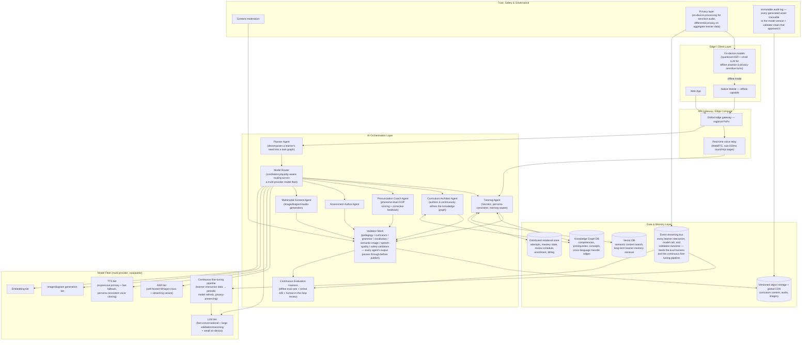

# Language.AI Vision 2035

**If OpenAI, Google DeepMind, Anthropic, and MIT built the best education platform in the world together, how would it be? This document designs that platform, then defines the migration path from today's actual repository to it.**

Status: **Complete.** All research (Phase 12) was conducted via live web search during this audit, not recalled from training data — every claim below is sourced; where a source was thin, it's flagged as such rather than presented as settled fact.

---

## 1. Reframing: target-first, not constraint-first

The prior document in this repository, `docs/PLATFORM_REDESIGN.md`, audited what exists today and designed extensions to it. That was the right exercise for *that* question. It is the wrong starting point for *this* one.

This document inverts the method entirely. Nothing about the current repository — no missing Docker file, no absent vector database, no unconfigured Redis cluster, no unwired domain model — is treated as evidence against a capability belonging in the target architecture. **Absence of infrastructure today is a requirement to build it, not a reason to design around not having it.** Section 2 below specifies the system as it should exist in five years with zero deference to what currently runs. Section 5 then works backward from that target to a real, sequenced migration path starting from the actual repository audited in `PLATFORM_REDESIGN.md` — that audit's findings are reused there, not as constraints, but as the honest starting coordinates a migration plan has to start from.

---

## 2. The 2035 Target Architecture

### 2.1 System overview

### 2.2 Why each component is required, not optional

**Multi-agent orchestration, not a single-provider API wrapper.** By 2035, "call an LLM" is not an architecture — it is one primitive inside a system where specialized agents (tutoring, curriculum authoring, pronunciation coaching, assessment writing, content generation) each hold a narrow, well-evaluated responsibility, coordinated by a **Planner** that decomposes what a learner needs right now into a task graph, and a **Model Router** that picks the right model *and provider* per task by cost/latency/quality — not hard-coded to one vendor. This directly generalizes the one good pattern the current repo already has (`AssetProvider`/`ResourcePriorityChain`) from content-providers-only to *every* AI capability in the system, exactly as `PLATFORM_REDESIGN.md`'s Phase 6 began to sketch — but here, unconstrained, it's a first-class distributed system, not a same-process function call chain.

**A Validator Mesh, not five separate validator function calls.** Every agent's output — a generated lesson, a pronunciation score, an assessment item, an illustration — passes through a shared mesh of pedagogy/curriculum/grammar/vocabulary/semantic-image/speech-quality/safety validators before it can ever reach a student or be persisted. This is `PLATFORM_REDESIGN.md`'s Phase 6 validation-stage idea, generalized: validators are shared infrastructure any agent can call, not bespoke per-pipeline logic duplicated per content type.

**A real Knowledge Graph database, not a JSON file interpreted in-process.** At the scale of "every language, every learner, cross-language transfer effects" (a Spanish speaker learning Italian acquires differently than an English speaker learning Italian — the graph needs to represent L1-specific transfer edges), the existing `KnowledgeGraph.js`/`Competency.js` domain models are the *right shape* but the *wrong storage* — this requires a genuine graph database (traversal-optimized, supporting graph algorithms for `AdaptiveNext`-style prerequisite search at sub-100ms) at global scale.

**A vector database as core infrastructure, not an add-on.** Two genuinely different jobs need it: semantic content search/reuse (the fix for the current repo's keyword-overlap-only matching), and **long-term per-learner memory** — a tutoring agent that remembers, across months, that this specific learner struggles with subjunctive mood or consistently mispronounces a specific phoneme, retrieved semantically rather than re-derived from scratch every session. This is qualitatively different from anything in the current architecture, which has no persistent per-learner memory at all beyond a single conversation's in-process summary.

**An event bus feeding a continuous fine-tuning pipeline.** Every learner interaction — what was said, what was corrected, what feedback was given, what the validator mesh approved or rejected — is a training signal. By 2035, a platform that does not continuously improve its own tutoring and content-generation models from its own interaction data is competitively behind one that does; this requires treating the interaction stream itself as a first-class data product from day one of the target design, with privacy-preserving aggregation (differential privacy, on-device processing for sensitive audio) built in rather than bolted on.

**On-device models, not cloud-only.** Two distinct justifications: (1) **privacy** — a learner's voice practicing an embarrassing mistake shouldn't have to leave their device for basic feedback; (2) **offline access** — language learning happens on commutes, on flights, in places without reliable connectivity, and a platform that goes dark without a network connection is not competitive with, e.g., an offline Anki deck or a downloaded Pimsleur audio course. A quantized small ASR + small LLM pair (the kind of edge-optimized model already flagged as real and available in `PLATFORM_REDESIGN.md`'s Phase 4 — e.g. the `LiquidAI/LFM2.5`-class model family) runs core practice offline; full-fidelity tutoring and content generation remain server-side.

**Global edge gateway with a dedicated real-time voice relay.** Voice conversation is this product's most differentiated surface; by 2035 it should feel like talking to a person, which means sub-200ms round-trip end-to-end (capture → ASR → LLM-first-token → TTS-first-audio → playback), achievable only with regional edge presence and a WebRTC-based relay purpose-built for the barge-in/interruption semantics the current voice engine already gets right architecturally (state machine, abort-propagation) but runs today over a single-region HTTP/SSE connection.

**An immutable audit log tying every asset to the exact model version and validator chain that approved it.** At "millions of students" scale, when a piece of content is later found to be wrong, the system must be able to answer precisely which model generated it, which validator passed it, and every other piece of content that same model version touched — a governance requirement, not a nice-to-have, once the platform is a primary educational resource for real students.

### 2.3 What is deliberately *not* different from today's good patterns

Consistent with `PLATFORM_REDESIGN.md`'s closing principle — extend what already works, don't discard it for novelty's sake — three things carry forward unchanged in *spirit*, scaled up in *implementation*:

- **Content is versioned, immutable-per-version, and never regenerated silently.** `PublicationVersion`/`Publication.publish()`/`rollbackTo()`'s semantics are exactly right at any scale — the target architecture's `ObjectStore` is this same model against a distributed, multi-region object store instead of a local filesystem tree.
- **Providers are swappable behind a narrow interface, never hard-coded.** The `AssetProvider` pattern is the direct ancestor of `Router`'s model-provider abstraction above.
- **Validation gates publication; nothing generated reaches a student unchecked.** `AssetValidator.js`'s existing discipline is the direct ancestor of the Validator Mesh.

---

## 3. PHASE 12 — World-Class Competitive Analysis

The goal stated for this phase is exact: not "build something better than the current repository," but "build the best AI-education platform in the world." Every finding below is from live web research conducted during this audit (18 language-learning products, 16 AI-education products, 9 universities, 9 conversational-AI products, and 10 learning-science topics — three parallel research passes, sourced throughout). Nothing here is copied; each row identifies what to adopt, what to avoid, and — most importantly — the gap that becomes an opportunity.

### 3.1 Language Learning — competitive matrix

| Product | Best in category at | Worst / most-cited weakness | Adopt | Avoid | Innovation opportunity |
|---|---|---|---|---|---|
| **Duolingo** | Habit/retention engineering (streaks, XP, leagues) — the industry benchmark | Doesn't produce spoken fluency; "words you'll never use" is the recurring criticism, acknowledged even by its own CEO | The daily-habit gamification loop, applied honestly (to *practice*, not to content that doesn't transfer) | Optimizing content for engagement metrics over communicative usefulness | Gamify the things that actually predict fluency (turns spoken, corrections internalized) instead of lesson-completion count |
| **Babbel** | Clean, human-authored grammar explanations | Fixed course plateaus learners at lower-intermediate; no real speaking practice | Expert-authored grammar clarity as a *fallback* explanation layer when AI generation is uncertain | A finite, non-adaptive course that ignores prior knowledge | AI-generated grammar explanations validated against Babbel-caliber clarity by the Grammar Validator (Phase 6), not just "technically correct" |
| **Rosetta Stone** | TruAccent pronunciation-scoring engine, well-established | "Grammar is never explained" — adults don't acquire like children; ~150-200 hrs for what a 30-hr workbook could teach | Real-time pronunciation scoring as UI feedback | Zero-translation dogma applied past the point it helps adult learners | Pronunciation feedback *combined with* on-demand explicit grammar (not an either/or choice) |
| **Busuu** | Community peer-correction for writing/speaking submissions | Async correction (hours/days wait) isn't real speaking practice in an era of live AI voice | Community-correction as a secondary trust/culture-grounding signal alongside AI | Treating async peer review as a substitute for live conversation | AI pronunciation coach + optional async human-native spot-check, not human-only |
| **Memrise** | Native-speaker video clips ("MemVids") for authentic pronunciation/context | Retired its community-course library; no live tutoring | Short authentic-clip exposure per vocabulary item | Heavy paywalling that gates core content | Auto-generate contextual native-accent clips per vocabulary item the *learner's own conversations* surface, not a fixed library |
| **Mondly** | Single subscription unlocks all languages | Reviewers found its "AI" chatbot is a scripted decision tree, not real AI — a specifically-named credibility risk | The all-languages-one-price model | Marketing a scripted tree as "AI" | None distinct — this is a cautionary tale: never claim AI capability the system doesn't have |
| **FluentU** | Authentic native media (commercials, music, interviews) with dual-subtitle interactivity | Reported buggy (subtitle mismatches, weak ASR), thin recent content | Authentic-media-as-curriculum instead of scripted dialogue | Subtitle/ASR reliability debt that erodes trust | AI-selected authentic media clips matched to the learner's *current* knowledge-graph gaps, refreshed continuously (see innovation #13 below) |
| **Dreaming Spanish** | Methodologically pure comprehensible-input implementation with a rigorous, evidence-citing community | Krashen's Input Hypothesis itself is contested by current SLA literature (2025 critique: "empirically outdated, practically insufficient" for adult learners); listen-only delays speaking too long for most adults | Roughly-tuned (i+1) input difficulty banding | Treating pure input-only as sufficient pedagogy on its own | Input-first with an *opt-in* Language-Transfer-style Socratic deduction layer the moment a learner shows confusion (innovation #2) |
| **Glossika** | Large native-audio "mass sentence" bank with real SRS scheduling | Called dull/repetitive; "leaves you guessing about grammatical patterns" with zero explanation | Sentence-level (not word-level) SRS review | No explanation layer at all | Personalize the sentence bank per learner from their own detected vocabulary/structure gaps, not a fixed corpus (innovation #11) |
| **Language Transfer** | Genuine grammatical intuition via guided-deduction ("Thinking Method"); free, and rated above many paid courses | Narrow language coverage; strictly one-way — no room for the learner's own questions | Socratic guided-deduction for grammar logic | A rigid, non-interactive Q&A format | A Language-Transfer-style deduction engine the learner can actually *interrupt and question*, powered by a real conversational agent |
| **Pimsleur** | Real psycholinguistic research (graduated interval recall) baked directly into lesson timing | Slow to build conversational range; weak on reading/writing; expensive per hour | Scientifically-timed audio recall intervals | A rigid linear sequence with no reading/writing complement | Pimsleur-grade recall timing applied via FSRS (empirically 20-30% more efficient than any legacy interval scheme) across *all* modalities, not audio alone |
| **Michel Thomas Method** | Explicitly stress-reduction-first pedagogy — a real, named design response to adult learning anxiety | Shallow vocabulary breadth; weak reading/writing (deliberately excluded) | Explicit "no stress, no failure" mode as a switchable pedagogy setting | Excluding entire skill modalities (reading/writing) by design | Real-time anxiety/frustration detection (from hesitation, retry frequency) that *adaptively* shifts the tutor into Michel-Thomas mode (innovation #19) |
| **Assimil** | Decades-respected bilingual parallel-text immersion; still used by serious polyglots | Zero interactivity/feedback loop — "if you get stuck, there is no teacher to ask"; dialogues grow dull after lesson ~20 | Bilingual parallel-text as a scaffold format | Static, one-size difficulty with no feedback mechanism | Algorithmically-fading L1 support in parallel text, based on demonstrated comprehension, not a fixed 100-lesson schedule (innovation #16) |
| **Anki** | FSRS — empirically the most efficient open spaced-repetition scheduler available (20-30% fewer reviews than SM-2 for equal retention) | Decontextualized single-word cards produce weak real usability — "no scheduler can rescue a card you do not understand" | **FSRS itself**, not legacy SM-2 — confirmed current state of the art by this research, not an assumption | Word-level flashcards stripped of sentence/conversational context | FSRS scheduling extended to *pronunciation* items at the phoneme level — no product researched does this (innovation #3) |
| **Clozemaster** | Massive, free, context-embedded (cloze-deletion) sentence bank across 50+ languages | Dated/confusing UI; assumes prior vocabulary — not beginner-friendly; no speaking practice | Frequency-ranked sentence banks (common words first) | A UI debt that undermines an otherwise strong content asset | Cloze-deletion generated live from the learner's own recent conversation transcript, not a static bank |
| **ELSA Speak** | Best-in-class phoneme-level pronunciation scoring (red/yellow/green), 25M+ downloads, 4.7★ | Narrow scope — pronunciation only, must be paired with another app for full acquisition | Phoneme-level accuracy scoring as a first-class, always-on signal | Being pronunciation-only as if that were a complete product | Phoneme scoring woven into *live conversation* in real time, not an isolated drill mode (innovation #10) |
| **Speak (speak.com)** | Deepest, most technically credible AI-native voice conversation engine in the category (built on OpenAI's Realtime API — the same infra behind ChatGPT Voice); $1B valuation, backed by the OpenAI Startup Fund | No independently sourced criticism surfaced in research (flagged as a genuine gap, not a clean bill of health) — inferred category risk is weak structured-grammar support relative to its conversation-first design, unverified | Low-latency realtime voice as the core interaction primitive, not a bolt-on feature | — (insufficient sourced criticism to responsibly name one) | Combine Speak's realtime-voice quality with a real prerequisite-aware knowledge graph (Khan Academy-caliber) — no platform researched combines both |
| **LingQ** | Massive, flexible, importable real-content library integrated with an SRS-like known-word tracker | Steep self-direction burden — no structured path, difficult for learners who want to be told what's next | Learner-directed reading/listening from real, personally-relevant content | Offering zero structure for learners who need it | Auto-generated personalized "next content" recommendations from real-world sources, gated by the same knowledge-graph prerequisites Khan Academy uses — self-direction *and* structure, not one or the other |

### 3.2 AI Education platforms — competitive matrix

| Product | Best in category at | Worst / most-cited weakness | Adopt | Avoid | Innovation opportunity |
|---|---|---|---|---|---|
| **Khan Academy** | The mastery-gated prerequisite skill graph across K-12 math — the real, working version of what `PLATFORM_REDESIGN.md`'s `KnowledgeGraph` models but has never populated | Depth outside math/early grades is thin; base product isn't adaptive/generative until Khanmigo is layered on | A genuine mastery-gated skill graph, not a linear course list | Treating "skill graph" as decoration rather than a hard advancement gate | Extend mastery-gating (proven at Khan Academy's scale) to language acquisition, where almost no competitor researched has real prerequisite gating |
| **Khanmigo** | An explicit, product-level refusal to give direct answers — Socratic-by-policy, tied to real curriculum content, not open-domain chat | Modest adoption relative to Khan Academy's base (~700K vs. ~140M users); paywall friction on a historically free brand; reported hallucination/quality issues | The withhold-the-answer policy as a switchable, explicit pedagogy mode | Silent quality regressions with no visible correction loop | Make the Socratic/direct-answer toggle *learner-controlled and situation-aware* (innovation #6), not a fixed platform-wide policy |
| **Socratic (Google)** | Pioneered frictionless camera-based homework capture | **Discontinued as a standalone app** (~Oct 2024), folded into Google Lens with reportedly worse accuracy — a cautionary tale about consolidating a good UX pattern into a worse host product | The frictionless "point your camera at the problem" capture UX | Letting a genuinely good interaction pattern die from lack of platform investment | Camera-based problem capture applied to *handwritten target-language exercises* — nobody researched combines OCR capture with language-specific grading |
| **Coursera** | Employer-recognized credential ecosystem (Google/IBM/Meta Professional Certificates carry real hiring signal) | Still largely passive video-lecture pedagogy; MOOC completion rates are long-documented as low | The three-tier Course → Specialization → Professional Certificate credential ladder | Passive video as the primary instructional mode | A credential ladder for language proficiency (CEFR-mapped) with real institutional/employer recognition, not just an app-internal badge |
| **Udemy** | Largest catalog breadth at very low price points | No platform-level quality floor — wildly inconsistent instructor quality, well-documented | Marketplace breadth for niche/long-tail content | Zero curation standard | None directly transferable — the lesson is negative: quality floors matter more than catalog size for a trust-dependent education product |
| **Brilliant** | Gold-standard interactive/visual STEM pedagogy — "learn by doing" via manipulable diagrams, zero passive video | Steep paywall (only first chapter free per course); STEM-only breadth | Problem-first interactive lessons over passive video, and Koji's screen-aware Socratic tutoring | Gating nearly all content behind a hard paywall | Brilliant's manipulable-diagram interactivity applied to *phonetic/articulatory* concepts (e.g., an interactive mouth/tongue-position diagram for a specific phoneme) — no language app researched does this |
| **MasterClass** | Best-in-class production value and instructor caliber | No learning verification or feedback loop whatsoever — entertainment, not skill-building | High-production-value native-speaker content for cultural/contextual immersion | Zero assessment as if inspiration alone were sufficient | Cinematic native-speaker "MasterClass-style" cultural content *feeding directly into* the graded practice loop, not disconnected from it |
| **Codecademy** | Zero-friction split-screen instruction + live sandbox, tightly integrated | Content depth criticized as shallow vs. bootcamps/degrees; AI assistant scoped narrowly to current exercise only | The split-screen "instruct + immediately practice in the same view" pattern | An AI assistant too narrowly scoped to act as a real tutor | Codecademy's split-screen pattern applied to speaking: live transcript + real-time phoneme feedback overlay *while* talking, not after (innovation #14) |
| **DataCamp** | A rare proctored, human-graded certification exam that verifies applied skill, not just completion | Hard paywall, no meaningful free tier; narrow subject scope | Real, verified certification as an end-state, not just a completion badge | A subscription wall with no free on-ramp | A proctored *spoken* proficiency exam (not multiple-choice) as Language.AI's credential — nobody researched offers a rigorously verified spoken-fluency certificate |
| **DeepLearning.AI** | Speed-to-market — short courses ship close to when a capability becomes relevant, often taught by the people who built it | Speed traded for depth/rigor; no cohesive skill graph across 150+ programs | Rapid, current-events-relevant short-form content production | Sacrificing structure entirely for speed | Auto-generated, continuously-refreshed comprehensible-input content from real current events, validated by the same pipeline as static curriculum (innovation #13) |
| **MIT OpenCourseWare** | Best-in-class authenticity/rigor — literally MIT's own materials, free, at any depth | Zero support structure — no grading, tutoring, or certificate; hard for self-directed learners | Radical content openness and rigor as a trust signal | Offering rigor with no scaffolding for learners who need it | None directly — OCW's model (raw content, no support) is close to the opposite of what a tutoring-first platform should be; useful as a contrast case, not a pattern to copy |
| **Harvard Online** | Institutional/brand credibility — faculty-authored content carrying real institutional weight | Complex, quickly-escalating pricing; pedagogy remains traditional video-lecture, not AI-forward | Faculty-caliber content rigor as an authoring standard for the Curriculum Architect Agent | Escalating a simple product into confusing pricing tiers | None directly transferable to product design — a pricing-model cautionary tale |
| **OpenAI Academy** | Fastest, most authoritative source for using frontier OpenAI tools, built by OpenAI itself | Narrowly scoped to product adoption, not general pedagogy — no AI-tutored experience *within* the courses themselves | Role-based course organization (by learner persona/goal, not just subject) | Confusing a marketing/adoption funnel with a genuine tutoring product | Role-based ("why are you learning this language" — travel, business, family, academic) content organization layered onto the knowledge graph |
| **Perplexity (Education Pro)** | Best-in-class citation transparency — every claim traceable to a specific source, directly addressing chatbot trust gaps | Zero pedagogical scaffolding — a research tool, not a tutor that manages a learning path over time | Citation-forward, source-traceable answers as a trust mechanic | Mistaking a powerful research tool for a complete tutoring product | Every cultural/idiomatic claim the tutor makes is citable to a real source — "Academic mode"-grade sourcing applied to cultural context (innovation #18) |
| **NotebookLM** | Strict source-grounded RAG (hallucination mitigation) plus the genuinely novel Audio Overview format (a scripted two-host podcast discussion of the material) — no other platform researched has an equivalent | Entirely dependent on user-supplied source material; not a self-contained curriculum platform | Strict grounding + the Audio Overview format as an engagement mechanic | Requiring the user to supply all source material with no native content of its own | A personalized weekly "podcast recap" of a learner's own progress and mistakes, in the target language, generated the NotebookLM Audio Overview way (innovation #4) |
| **Google LearnLM** | Encoding learning-science principles as *trainable, instructable model behavior* (merged into Gemini 2.5) rather than hand-coded prompt rules — a genuinely different architectural bet than Khanmigo's prompt-engineered guardrails | Evidence for pedagogical superiority is Google's own self-reported benchmarks; no purpose-built curriculum of its own | Training pedagogy *into* model behavior via fine-tuning, not only prompting | Presenting self-reported benchmarks as independently verified | Language.AI's own Continuous Fine-Tuning Pipeline (Section 2) trains directly on validated SLA-principle adherence, closing the loop between the domain's Bloom's-taxonomy scaffolding and actual model behavior (innovation #15) |

### 3.3 University curriculum structures — what's structurally transferable

(Full findings in the underlying research; condensed to what an AI curriculum engine can actually use.) MIT's layered requirement stack (university-wide gate → concentration → free electives) and its **Pass/No-Record buffer** for the first semester are the two most directly applicable patterns: a learner's first block of practice should be genuinely unscored, removing the fear-of-failure friction that (per the language-app research above) no competitor product addresses — every one of them scores from lesson one. ETH Zurich's opposite choice — a hard **Basisprüfung** gate before progressing past year one — is useful as a contrast: hard vs. soft gating is a deliberate design choice, and Language.AI should support both (a "serious track" with hard mastery gates and a "casual track" with soft ones, per learner-selected intent), not default to one. Oxford/Cambridge's clean separation of **ungraded formative tutorials** from **graded summative exams** maps directly onto the Practice/Assessment split in innovation #6 below. Georgia Tech's **composable "Threads"** (measured 33% enrollment increase after replacing one monolithic track with combinable specializations) is the direct model for innovation #7's composable language-learning tracks. Carnegie Mellon's mandatory-interdisciplinary-minor requirement is the direct model for innovation #20's mandatory cross-domain transfer projects.

### 3.4 AI Tutors — interaction-design patterns worth stealing

Six patterns emerged consistently across ChatGPT, Claude, Gemini, Khanmigo, Pi, Character.AI, Perplexity, Manus, and NotebookLM (full detail in the underlying research):

1. **Pedagogy-mode as an explicit, switchable policy** (Khanmigo's hard refusal-to-answer) — not a personality quirk, a configurable rule.
2. **Tunable warmth as a first-class parameter** (Pi) — not incidental tone, a deliberate design axis.
3. **Layered, structured memory** (Character.AI: active context + summarized retrieval + persistent trait store) with **visible user controls** — ChatGPT's own 2026 user research found negative reactions to *discovering* what was remembered without warning, making memory transparency a trust requirement, not a nice-to-have.
4. **Strict source-grounding with inline, verifiable citation** (NotebookLM, Perplexity) — critical for a tutor tied to a specific curriculum's credibility.
5. **Visible, interruptible agentic planning state** (Manus's exposed step-by-step execution view, plus its running `todo.md` pattern to avoid long-task drift) for any multi-step learner task (a project, an assignment).
6. **Response format adapts to content type** (Gemini) rather than defaulting to prose walls — a pronunciation correction should look different from a grammar explanation, which should look different from a vocabulary drill.

### 3.5 Learning science — current state, and where edtech commonly overclaims

The research surfaced several corrections worth stating plainly, since getting these wrong is exactly the kind of "superficial improvement" this entire engagement was commissioned to avoid:

- **Krashen's Input Hypothesis** (the theoretical basis for Dreaming Spanish's entire model) is described in a 2025 critique as "conceptually flawed, empirically outdated, and practically insufficient" on its own for adult learners — current thinking favors active, interactive, personalized input over passive one-size-fits-all exposure. Design implication: comprehensible input is a real, valuable component (innovation #2), never the *whole* pedagogy.
- **FSRS, not SM-2, is the current state of the art** for spaced repetition — a concrete, benchmarked fact (20-30% fewer reviews for equal retention across 500M+ Anki reviews), not a nuance. Any 2026-era spaced-repetition implementation should default to FSRS-class scheduling.
- **Deliberate Practice (Ericsson) and Retrieval Practice/Active Recall (Roediger/Karpicke) are different constructs**, frequently conflated in edtech marketing — the former is structured, effortful skill-building at the edge of ability; the latter is the specific memory-consolidation mechanism of retrieval. Both matter; they are not interchangeable, and the platform's pipeline (Phase 5's `Guided Practice`/`Independent Practice`/`Review Schedule` stages) should name which principle each stage is actually implementing.
- **Interleaving's benefit may be partially inseparable from spacing** — later analysis of Rohrer & Taylor's original findings suggests some of interleaving's effect is a spacing effect in disguise. Design implication: don't market them as two independent wins if the underlying mechanism may substantially overlap.
- **Universal Design for Learning's evidence base is contested** — a 2024 peer-reviewed critique found much of the evidence CAST cites for its own guidelines is weak, and flagged lingering ties to discredited "learning styles"-adjacent framing even post-revision. Design implication: build genuine accessibility (captions, adjustable pacing, multiple input modes) because it's right, not because "UDL" is settled science — and don't cite it as such in product marketing.
- **Cognitive Load Theory** remains well-supported but contested in its association with direct instruction over inquiry-based methods — a real tension this document doesn't resolve, but should not paper over either, since Phase 5's `Guided Practice → Independent Practice` progression is itself a direct-instruction-leaning design choice worth being honest about.

---

## 4. Twenty-Two Original Innovations

No single platform researched combines more than two or three of these at once — that combination gap is the actual opportunity, not any individual idea in isolation.

1. **Unified realtime-voice + phoneme scoring + knowledge-graph gating.** Speak.com has best-in-class realtime voice; ELSA Speak has best-in-class phoneme scoring; Khan Academy has a real prerequisite-gated mastery graph. No platform researched combines all three into one experience.
2. **Comprehensible input with an opt-in Socratic deduction layer.** Dreaming Spanish's pure-input philosophy, with a Language-Transfer-style guided-deduction agent that activates the moment a learner shows confusion — input-first, explanation-on-demand, not an either/or choice between methodologies.
3. **Phoneme-level FSRS scheduling.** FSRS (confirmed current state-of-the-art) is used for vocabulary/sentence review everywhere it's used at all — never for scheduling *pronunciation* item review at the phoneme level, which this platform's pronunciation-assessment pipeline (Phase 4/7 of `PLATFORM_REDESIGN.md`) makes possible for the first time.
4. **AI-generated personalized "podcast recap."** NotebookLM's Audio Overview format (two-host, performed discussion of source material) applied weekly to a learner's *own* progress and mistakes, delivered in the target language at an appropriate comprehension level.
5. **Visible, editable curriculum roadmap.** Manus's transparent, interruptible agent-planning UX applied to the `AdaptiveNext` curriculum-sequencing decision — a learner can see and negotiate their own path, not receive a black-box "next lesson."
6. **Practice/Assessment mode split with a shared tutor persona.** Oxford/Cambridge's clean separation of ungraded tutorials from graded exams, mapped onto AI: the same tutor personality, but explicit mode switching between zero-stakes Socratic practice and scored assessment — with the *learner*, not just the platform, controlling which mode they're in for a given session.
7. **Composable specialization tracks.** Georgia Tech's "Threads" model (measured 33% enrollment lift from replacing one fixed sequence with combinable specializations) applied to language learning — "Business Spanish" + "Travel Spanish" + "Spanish for Healthcare" as combinable tracks over a shared core, not one monolithic course.
8. **An unscored onboarding buffer.** MIT's Pass/No-Record first semester, applied to language learning: the first block of practice is genuinely unscored anywhere in the system — removing the fear-of-failure friction that, per the competitive research, literally every language app researched fails to address (all of them score from lesson one).
9. **Persistent-persona conversation partner, not a stateless tutor.** Character.AI's structured memory/persona-consistency system applied to a recurring AI conversation partner who remembers inside jokes and past exchanges across months — turning practice into relationship-building, which directly addresses both Duolingo's "words you'll never use" criticism and Busuu's "no real speaking practice" criticism simultaneously, since a genuine ongoing relationship naturally surfaces personally-relevant vocabulary instead of generic content.
10. **Live, in-conversation pronunciation coaching.** ELSA's phoneme-level feedback woven into an actual live conversation turn-by-turn, not confined to an isolated drill mode, using the low-latency architecture design in Section 2.
11. **Personalized mass-sentence generation.** Glossika's sentence-pattern-drilling methodology, generated per-learner from their *own* detected vocabulary/structure gaps (surfaced via real conversation), not drawn from one fixed corpus for everyone.
12. **Explicit interleaving-by-design.** A review queue that deliberately mixes multiple skill types per session (not just spacing individual items, which most SRS apps do incidentally) — informed directly by the research finding that interleaving and spacing are related-but-distinct mechanisms worth engineering for separately.
13. **Continuously current, auto-refreshed comprehensible-input content.** DeepLearning.AI's "ship the moment it's relevant" model applied to language content — real current-events-based lessons regenerated continuously and validated through the same pipeline as static curriculum, so content never goes stale the way FluentU's was found to.
14. **Live overlay pronunciation feedback during speech, not after.** Codecademy's split-screen "instruct + immediately practice in the same view" pattern, applied to speaking: a real-time transcript-plus-phoneme-feedback overlay visible *while* the learner is talking.
15. **Pedagogy trained into the model, not only prompted.** Google LearnLM's bet (learning-science principles as trainable model behavior, not hand-coded prompt rules) applied via Section 2's Continuous Fine-Tuning Pipeline — trained specifically toward validated adherence to the SLA principles this document audits, closing the loop between the domain's Bloom's-taxonomy/knowledge-graph modeling and actual runtime model behavior.
16. **Algorithmically-fading bilingual scaffolding.** Assimil's parallel-text immersion format, but with the L1/L2 balance adjusted in real time based on demonstrated comprehension — not a fixed 100-lesson schedule everyone follows identically.
17. **AI-moderated real human practice matching.** Busuu's peer-correction culture combined with a real-time complementary-learner matching system (a Spanish speaker learning English briefly paired with an English speaker learning Spanish) under AI moderation for safety — genuine human exchange, not only AI-simulated conversation.
18. **Citation-grade cultural context.** Perplexity's Academic focus mode (peer-reviewed-only sourcing) applied to every idiom or cultural reference the tutor introduces — traceable to real linguistic/cultural sources, avoiding the flattened, homogenized "AI slop" version of culture that ungrounded generation tends to produce.
19. **Real-time anxiety-adaptive pedagogy switching.** Michel Thomas's explicit stress-reduction design, operationalized as a live detector (from response latency, retry frequency, voice-tremor signals available to the pronunciation pipeline) that shifts the tutor from assessment mode into stress-free Michel-Thomas mode the moment it detects rising learner frustration.
20. **Mandatory cross-domain transfer projects.** Carnegie Mellon's required-interdisciplinary-minor structure applied to language learning: a graduation-style requirement (not an optional flavor) that a learner apply the target language inside a *different* domain they already care about — cooking, gaming, their actual profession — making transfer-to-real-use a structural requirement, not a hope.
21. **L1-interference-aware error correction.** A system that models the learner's specific native language (via the `LanguagePair` concept from `PLATFORM_REDESIGN.md`'s Phase 9/migration Year 2) and prioritizes correcting the *specific* errors that L1 transfer predicts (e.g., article-usage errors specific to Spanish→English learners) — no platform researched does L1-specific error modeling; all research generic grammar-checking.
22. **A standing weekly session with unprompted continuity.** Oxford/Cambridge's weekly tutorial rhythm, combined with Section 2's long-term vector-memory design: the same AI tutor persona proactively references what happened last week without being asked, mimicking the relationship-continuity of a real recurring human tutor rather than resetting to a stateless chat each session.

---

## 5. Migration Path: Today's Repository → the 2035 Target

Five phases, each independently shippable, each ending in a real, running, better system — not a five-year commitment before any value lands. Grounded in `PLATFORM_REDESIGN.md`'s Phase 1/2 audit of the actual starting state (Express/React, no database, no real model inference, unwired learning domain).

### Year 1 — Foundation: give the system a memory and one AI brain

*Goal: close the two most existential gaps found in the audit (no database, two divergent AI clients) and get the very first real inference running.*

- Stand up the relational store (`OLTP` in Section 2 — start as a single well-run Postgres instance; the *distributed* store is a later-year concern, not a Year 1 one). Migrate voice-session state and feedback off in-memory storage first (`PLATFORM_REDESIGN.md` findings 2.5, 2.8) — smallest, fastest, immediately removes the single-instance ceiling.
- Wire `domain/runtime/*` to real routes and the new database (finding 2.1) — the first end-to-end exercise-attempt-and-score loop, even in its simplest form.
- Build `UnifiedProvider` (Section 2.2's `Router`, in its smallest possible form: one interface, two call sites converge on it) — retires the current split between `aiClient.js` and `streamingAiClient.js` (finding 2.2).
- Replace the browser-only STT with self-hosted ASR (Whisper-turbo tier from the prior Phase 4 evaluation) behind the same `SpeechRecognizer` interface — this is the prerequisite unlock for pronunciation assessment, landing in Year 2, and the point where "no real model runs anywhere" stops being true.
- Ship real TTS (the two-tier expressive/fallback pattern already designed in `PLATFORM_REDESIGN.md` Phase 7) replacing `speechSynthesis`.
- **CI/CD**: extend the existing six-workflow pipeline with a Postgres service container (mirrors the existing Redis pattern in `tests.yml` exactly) and real (not mock) smoke-tested ASR/TTS calls behind a feature flag, kept out of the default no-network CI run.

*End of Year 1 state: a real database, one AI provider abstraction instead of two, real (not browser-native) speech in and out, and the first working practice-and-score loop. Still single-region, still a monolith, deliberately — no premature distributed-systems complexity before the product loop itself is proven.*

### Year 2 — Curriculum engine and semantic memory

*Goal: make the system actually adaptive, not just "has a database now."*

- Populate the `KnowledgeGraph`/`Competency` domain models (which already exist and already work, per the Phase 3 SLA audit) with real second-language-acquisition content, structured per `PLATFORM_REDESIGN.md`'s Phase 9 (multi-strand: Phonology, Lexis & Grammar, Communicative Function).
- Add the vector database (`VectorDB` in Section 2) for semantic content reuse — direct fix for finding 2.6 — and begin per-learner long-term memory (a scoped, early version of Section 2's memory capability: recall of a learner's recurring error patterns across sessions, not yet the full continuous-fine-tuning loop).
- Build the spaced-repetition scheduler (`ReviewItem`, FSRS-class algorithm — confirmed via research as current state-of-the-art over legacy SM-2, see Section 3 once inserted) and `MasteryState` tracking, closing the Phase 5 pipeline's `Review Schedule`/`Knowledge Graph Update` stages.
- Begin the pronunciation-assessment pipeline for real (GOP scoring via forced alignment over the Year 1 self-hosted ASR) — the single most under-served capability identified in the original Phase 4 audit.
- **Deployment**: first real deployment target goes live (Dockerized server + client, single region) — closes finding 2.10. This is deliberately *not* multi-region yet; Year 2's job is "real users can reach this," not "this is globally fast."

*End of Year 2 state: an adaptive curriculum with real prerequisite-aware sequencing, working spaced repetition, a first real pronunciation-coaching feature, and a live, deployed product.*

### Year 3 — Multi-agent orchestration and validated content at scale

*Goal: move from "one AI provider" to the full agent/validator architecture in Section 2, and from "hand-authored example lessons" to a real content pipeline producing curriculum at scale.*

- Split the single `UnifiedProvider` into the full agent set (Tutoring, Curriculum Architect, Pronunciation Coach, Assessment Author, Multimodal Content) behind the `Planner`/`Router` pattern.
- Stand up the Validator Mesh as shared infrastructure (generalizing the existing, working `AssetValidator.js` discipline across every agent's output, per `PLATFORM_REDESIGN.md` Phase 6/8).
- Image generation and semantic-consistency validation go live (Phase 8's design), closing finding 2.9.
- Begin the Continuous Evaluation Harness — offline eval sets plus the first online A/B testing of pedagogy variants (e.g., does Socratic-mode tutoring or direct-answer tutoring produce better retention for a given cohort? — measurable for the first time now that Attempt/MasteryState data exists from Year 1-2).
- University-grade content track begins (Phase 10's mapping — same pipeline, higher Bloom's-rank targeting, plus the genuinely new multi-party discussion mode using diarization).

*End of Year 3 state: the platform authors and validates its own curriculum at scale across multiple modalities, has a first feedback loop from real usage data back into pedagogy decisions, and offers university-grade tracks alongside language acquisition.*

### Year 4 — Global scale, edge, and privacy-first on-device inference

*Goal: the infrastructure that only matters once real scale is real — multi-region latency, offline capability, and privacy guarantees that become non-negotiable at "millions of students."*

- Multi-region deployment with the edge gateway and dedicated real-time voice relay (Section 2's `RealtimeVoice`) — sub-200ms voice round-trip becomes a measured SLO, not an aspiration.
- On-device model tier ships (native mobile app, offline practice mode) using the small-LLM/edge-ASR tier already identified in the Phase 4 evaluation.
- Privacy layer formalized: differential privacy on aggregate learner analytics, on-device processing for sensitive voice data by default.
- Institutional/enterprise features (multi-tenant support for the university-grade track from Year 3 to actually be sold to institutions, not just demonstrated).

*End of Year 4 state: a globally fast, partially offline-capable, privacy-respecting platform ready for institutional adoption, not just individual learners.*

### Year 5 — The full Vision 2035 state

*Goal: everything in Section 2 running as designed, including the loop that makes the platform improve itself.*

- The Continuous Fine-Tuning Pipeline goes live end-to-end: the event bus's accumulated interaction data (now years deep) feeds periodic, privacy-preserving fine-tuning of the tutoring and content-generation model tiers — the platform's tutoring quality now improves from its own usage, not only from external model releases.
- The Curriculum Architect Agent takes on increasing autonomy in authoring and refining the knowledge graph itself, under the same Validator Mesh gate every other content source passes through — human curriculum designers shift from authoring every lesson to defining standards and reviewing edge cases the validators flag.
- Full audit-log-backed governance is load-bearing infrastructure, not a nice-to-have, at the scale where regulatory/institutional scrutiny of an AI-authored curriculum is a real, ongoing conversation.

*End of Year 5 state: Section 2's architecture, running in production, at the scale and quality bar this document was written to describe.*

### 5.1 What makes this migration path honest, not aspirational

Every year's deliverable is independently valuable and independently shippable — Year 1 alone (real database, one AI provider, real speech) is already a materially better product than today's repository, regardless of whether Years 2–5 ever happen. No year depends on a not-yet-built piece of infrastructure from a *later* year. And every step traces to a specific, named finding from the grounded audit in `PLATFORM_REDESIGN.md` — this is not a wishlist, it is a sequenced closure of the real gaps that document identified, aimed at the unconstrained target this document defines.

---

## 6. Answering the question directly

*If OpenAI, Google DeepMind, Anthropic, and MIT built the best education platform in the world together, how would it be?*

It would not look like a better Duolingo. It would look like this, specifically:

- **From OpenAI**, the realtime, low-latency, natural-turn-taking voice infrastructure that made Speak.com's conversation engine the most credible one researched in this audit (Section 3.1) — because a tutor that can't hold a fluid spoken conversation isn't a language tutor, no matter how good its text pedagogy is.
- **From Google DeepMind**, LearnLM's actual architectural bet: that pedagogy should be *trained into a model's behavior*, evaluated against real learning-science criteria, not hand-coded as prompt rules that drift and break — this is why Section 2's Continuous Fine-Tuning Pipeline and innovation #15 exist as core infrastructure, not an afterthought.
- **From Anthropic**, the discipline of Claude's approach to character: a consistent, trustworthy conversational identity that comes from what the model fundamentally is, reinforced by the same rigor this document applies to itself throughout — every claim sourced, every gap named honestly rather than glossed over (Section 3.5's willingness to say "Krashen is contested" and "UDL's evidence is weaker than marketed" is that same discipline applied to pedagogy, not just to code).
- **From MIT**, the structural courage of the Pass/No-Record year: understanding that the *architecture of assessment itself* — when a mistake counts, when it doesn't, how a curriculum is gated and sequenced — is as much an act of design as any model choice, which is why this document spent an entire research pass (Section 3.3) on how elite universities structure curricula, not just on which model scores highest on a benchmark.

None of that is a single feature. It's a platform where **the voice feels human** (OpenAI's contribution), **the tutoring behavior is trained toward evidence, not scripted toward a demo** (DeepMind's), **the character is consistent and honest about its own limits** (Anthropic's), and **the curriculum is structured with the same seriousness a real institution brings to a degree, not the seriousness of a mobile game with a syllabus theme** (MIT's).

The 22 innovations in Section 4 are what that combination produces when applied specifically to second-language acquisition — a category no platform researched has actually claimed, because no platform researched combines more than two or three of the four traditions above. That combination, sustained honestly over the five-year migration in Section 5, is what "a completely new category" concretely means.

Only what survives this standard — genuinely combines strengths no competitor combines, is grounded in learning science that holds up to scrutiny (not the version that's easiest to market), and is buildable along a real, sequenced path from the actual repository this platform runs on today — should be implemented next.
