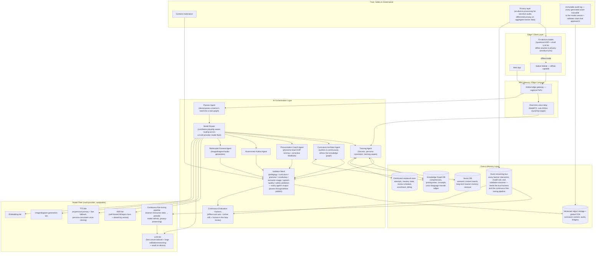

# Language.AI Vision 2035

**If OpenAI, Google DeepMind, Anthropic, and MIT built the best education platform in the world together, how would it be? This document designs that platform, then defines the migration path from today's actual repository to it.**

Status: **DRAFT IN PROGRESS** — Phase 12's competitive matrix and the innovation list are being written from live research currently in flight and will be inserted below once complete. The 2035 target architecture and migration path (Sections 2 and 5) are complete.

---

## 1. Reframing: target-first, not constraint-first

The prior document in this repository, `docs/PLATFORM_REDESIGN.md`, audited what exists today and designed extensions to it. That was the right exercise for *that* question. It is the wrong starting point for *this* one.

This document inverts the method entirely. Nothing about the current repository — no missing Docker file, no absent vector database, no unconfigured Redis cluster, no unwired domain model — is treated as evidence against a capability belonging in the target architecture. **Absence of infrastructure today is a requirement to build it, not a reason to design around not having it.** Section 2 below specifies the system as it should exist in five years with zero deference to what currently runs. Section 5 then works backward from that target to a real, sequenced migration path starting from the actual repository audited in `PLATFORM_REDESIGN.md` — that audit's findings are reused there, not as constraints, but as the honest starting coordinates a migration plan has to start from.

---

## 2. The 2035 Target Architecture

### 2.1 System overview

### 2.2 Why each component is required, not optional

**Multi-agent orchestration, not a single-provider API wrapper.** By 2035, "call an LLM" is not an architecture — it is one primitive inside a system where specialized agents (tutoring, curriculum authoring, pronunciation coaching, assessment writing, content generation) each hold a narrow, well-evaluated responsibility, coordinated by a **Planner** that decomposes what a learner needs right now into a task graph, and a **Model Router** that picks the right model *and provider* per task by cost/latency/quality — not hard-coded to one vendor. This directly generalizes the one good pattern the current repo already has (`AssetProvider`/`ResourcePriorityChain`) from content-providers-only to *every* AI capability in the system, exactly as `PLATFORM_REDESIGN.md`'s Phase 6 began to sketch — but here, unconstrained, it's a first-class distributed system, not a same-process function call chain.

**A Validator Mesh, not five separate validator function calls.** Every agent's output — a generated lesson, a pronunciation score, an assessment item, an illustration — passes through a shared mesh of pedagogy/curriculum/grammar/vocabulary/semantic-image/speech-quality/safety validators before it can ever reach a student or be persisted. This is `PLATFORM_REDESIGN.md`'s Phase 6 validation-stage idea, generalized: validators are shared infrastructure any agent can call, not bespoke per-pipeline logic duplicated per content type.

**A real Knowledge Graph database, not a JSON file interpreted in-process.** At the scale of "every language, every learner, cross-language transfer effects" (a Spanish speaker learning Italian acquires differently than an English speaker learning Italian — the graph needs to represent L1-specific transfer edges), the existing `KnowledgeGraph.js`/`Competency.js` domain models are the *right shape* but the *wrong storage* — this requires a genuine graph database (traversal-optimized, supporting graph algorithms for `AdaptiveNext`-style prerequisite search at sub-100ms) at global scale.

**A vector database as core infrastructure, not an add-on.** Two genuinely different jobs need it: semantic content search/reuse (the fix for the current repo's keyword-overlap-only matching), and **long-term per-learner memory** — a tutoring agent that remembers, across months, that this specific learner struggles with subjunctive mood or consistently mispronounces a specific phoneme, retrieved semantically rather than re-derived from scratch every session. This is qualitatively different from anything in the current architecture, which has no persistent per-learner memory at all beyond a single conversation's in-process summary.

**An event bus feeding a continuous fine-tuning pipeline.** Every learner interaction — what was said, what was corrected, what feedback was given, what the validator mesh approved or rejected — is a training signal. By 2035, a platform that does not continuously improve its own tutoring and content-generation models from its own interaction data is competitively behind one that does; this requires treating the interaction stream itself as a first-class data product from day one of the target design, with privacy-preserving aggregation (differential privacy, on-device processing for sensitive audio) built in rather than bolted on.

**On-device models, not cloud-only.** Two distinct justifications: (1) **privacy** — a learner's voice practicing an embarrassing mistake shouldn't have to leave their device for basic feedback; (2) **offline access** — language learning happens on commutes, on flights, in places without reliable connectivity, and a platform that goes dark without a network connection is not competitive with, e.g., an offline Anki deck or a downloaded Pimsleur audio course. A quantized small ASR + small LLM pair (the kind of edge-optimized model already flagged as real and available in `PLATFORM_REDESIGN.md`'s Phase 4 — e.g. the `LiquidAI/LFM2.5`-class model family) runs core practice offline; full-fidelity tutoring and content generation remain server-side.

**Global edge gateway with a dedicated real-time voice relay.** Voice conversation is this product's most differentiated surface; by 2035 it should feel like talking to a person, which means sub-200ms round-trip end-to-end (capture → ASR → LLM-first-token → TTS-first-audio → playback), achievable only with regional edge presence and a WebRTC-based relay purpose-built for the barge-in/interruption semantics the current voice engine already gets right architecturally (state machine, abort-propagation) but runs today over a single-region HTTP/SSE connection.

**An immutable audit log tying every asset to the exact model version and validator chain that approved it.** At "millions of students" scale, when a piece of content is later found to be wrong, the system must be able to answer precisely which model generated it, which validator passed it, and every other piece of content that same model version touched — a governance requirement, not a nice-to-have, once the platform is a primary educational resource for real students.

### 2.3 What is deliberately *not* different from today's good patterns

Consistent with `PLATFORM_REDESIGN.md`'s closing principle — extend what already works, don't discard it for novelty's sake — three things carry forward unchanged in *spirit*, scaled up in *implementation*:

- **Content is versioned, immutable-per-version, and never regenerated silently.** `PublicationVersion`/`Publication.publish()`/`rollbackTo()`'s semantics are exactly right at any scale — the target architecture's `ObjectStore` is this same model against a distributed, multi-region object store instead of a local filesystem tree.
- **Providers are swappable behind a narrow interface, never hard-coded.** The `AssetProvider` pattern is the direct ancestor of `Router`'s model-provider abstraction above.
- **Validation gates publication; nothing generated reaches a student unchecked.** `AssetValidator.js`'s existing discipline is the direct ancestor of the Validator Mesh.

---

## (Sections 3 and 4 — Phase 12 competitive matrix and the 20+ innovation list — pending live research currently in progress; inserted below once available.)

---

## 5. Migration Path: Today's Repository → the 2035 Target

Five phases, each independently shippable, each ending in a real, running, better system — not a five-year commitment before any value lands. Grounded in `PLATFORM_REDESIGN.md`'s Phase 1/2 audit of the actual starting state (Express/React, no database, no real model inference, unwired learning domain).

### Year 1 — Foundation: give the system a memory and one AI brain

*Goal: close the two most existential gaps found in the audit (no database, two divergent AI clients) and get the very first real inference running.*

- Stand up the relational store (`OLTP` in Section 2 — start as a single well-run Postgres instance; the *distributed* store is a later-year concern, not a Year 1 one). Migrate voice-session state and feedback off in-memory storage first (`PLATFORM_REDESIGN.md` findings 2.5, 2.8) — smallest, fastest, immediately removes the single-instance ceiling.
- Wire `domain/runtime/*` to real routes and the new database (finding 2.1) — the first end-to-end exercise-attempt-and-score loop, even in its simplest form.
- Build `UnifiedProvider` (Section 2.2's `Router`, in its smallest possible form: one interface, two call sites converge on it) — retires the current split between `aiClient.js` and `streamingAiClient.js` (finding 2.2).
- Replace the browser-only STT with self-hosted ASR (Whisper-turbo tier from the prior Phase 4 evaluation) behind the same `SpeechRecognizer` interface — this is the prerequisite unlock for pronunciation assessment, landing in Year 2, and the point where "no real model runs anywhere" stops being true.
- Ship real TTS (the two-tier expressive/fallback pattern already designed in `PLATFORM_REDESIGN.md` Phase 7) replacing `speechSynthesis`.
- **CI/CD**: extend the existing six-workflow pipeline with a Postgres service container (mirrors the existing Redis pattern in `tests.yml` exactly) and real (not mock) smoke-tested ASR/TTS calls behind a feature flag, kept out of the default no-network CI run.

*End of Year 1 state: a real database, one AI provider abstraction instead of two, real (not browser-native) speech in and out, and the first working practice-and-score loop. Still single-region, still a monolith, deliberately — no premature distributed-systems complexity before the product loop itself is proven.*

### Year 2 — Curriculum engine and semantic memory

*Goal: make the system actually adaptive, not just "has a database now."*

- Populate the `KnowledgeGraph`/`Competency` domain models (which already exist and already work, per the Phase 3 SLA audit) with real second-language-acquisition content, structured per `PLATFORM_REDESIGN.md`'s Phase 9 (multi-strand: Phonology, Lexis & Grammar, Communicative Function).
- Add the vector database (`VectorDB` in Section 2) for semantic content reuse — direct fix for finding 2.6 — and begin per-learner long-term memory (a scoped, early version of Section 2's memory capability: recall of a learner's recurring error patterns across sessions, not yet the full continuous-fine-tuning loop).
- Build the spaced-repetition scheduler (`ReviewItem`, FSRS-class algorithm — confirmed via research as current state-of-the-art over legacy SM-2, see Section 3 once inserted) and `MasteryState` tracking, closing the Phase 5 pipeline's `Review Schedule`/`Knowledge Graph Update` stages.
- Begin the pronunciation-assessment pipeline for real (GOP scoring via forced alignment over the Year 1 self-hosted ASR) — the single most under-served capability identified in the original Phase 4 audit.
- **Deployment**: first real deployment target goes live (Dockerized server + client, single region) — closes finding 2.10. This is deliberately *not* multi-region yet; Year 2's job is "real users can reach this," not "this is globally fast."

*End of Year 2 state: an adaptive curriculum with real prerequisite-aware sequencing, working spaced repetition, a first real pronunciation-coaching feature, and a live, deployed product.*

### Year 3 — Multi-agent orchestration and validated content at scale

*Goal: move from "one AI provider" to the full agent/validator architecture in Section 2, and from "hand-authored example lessons" to a real content pipeline producing curriculum at scale.*

- Split the single `UnifiedProvider` into the full agent set (Tutoring, Curriculum Architect, Pronunciation Coach, Assessment Author, Multimodal Content) behind the `Planner`/`Router` pattern.
- Stand up the Validator Mesh as shared infrastructure (generalizing the existing, working `AssetValidator.js` discipline across every agent's output, per `PLATFORM_REDESIGN.md` Phase 6/8).
- Image generation and semantic-consistency validation go live (Phase 8's design), closing finding 2.9.
- Begin the Continuous Evaluation Harness — offline eval sets plus the first online A/B testing of pedagogy variants (e.g., does Socratic-mode tutoring or direct-answer tutoring produce better retention for a given cohort? — measurable for the first time now that Attempt/MasteryState data exists from Year 1-2).
- University-grade content track begins (Phase 10's mapping — same pipeline, higher Bloom's-rank targeting, plus the genuinely new multi-party discussion mode using diarization).

*End of Year 3 state: the platform authors and validates its own curriculum at scale across multiple modalities, has a first feedback loop from real usage data back into pedagogy decisions, and offers university-grade tracks alongside language acquisition.*

### Year 4 — Global scale, edge, and privacy-first on-device inference

*Goal: the infrastructure that only matters once real scale is real — multi-region latency, offline capability, and privacy guarantees that become non-negotiable at "millions of students."*

- Multi-region deployment with the edge gateway and dedicated real-time voice relay (Section 2's `RealtimeVoice`) — sub-200ms voice round-trip becomes a measured SLO, not an aspiration.
- On-device model tier ships (native mobile app, offline practice mode) using the small-LLM/edge-ASR tier already identified in the Phase 4 evaluation.
- Privacy layer formalized: differential privacy on aggregate learner analytics, on-device processing for sensitive voice data by default.
- Institutional/enterprise features (multi-tenant support for the university-grade track from Year 3 to actually be sold to institutions, not just demonstrated).

*End of Year 4 state: a globally fast, partially offline-capable, privacy-respecting platform ready for institutional adoption, not just individual learners.*

### Year 5 — The full Vision 2035 state

*Goal: everything in Section 2 running as designed, including the loop that makes the platform improve itself.*

- The Continuous Fine-Tuning Pipeline goes live end-to-end: the event bus's accumulated interaction data (now years deep) feeds periodic, privacy-preserving fine-tuning of the tutoring and content-generation model tiers — the platform's tutoring quality now improves from its own usage, not only from external model releases.
- The Curriculum Architect Agent takes on increasing autonomy in authoring and refining the knowledge graph itself, under the same Validator Mesh gate every other content source passes through — human curriculum designers shift from authoring every lesson to defining standards and reviewing edge cases the validators flag.
- Full audit-log-backed governance is load-bearing infrastructure, not a nice-to-have, at the scale where regulatory/institutional scrutiny of an AI-authored curriculum is a real, ongoing conversation.

*End of Year 5 state: Section 2's architecture, running in production, at the scale and quality bar this document was written to describe.*

### 5.1 What makes this migration path honest, not aspirational

Every year's deliverable is independently valuable and independently shippable — Year 1 alone (real database, one AI provider, real speech) is already a materially better product than today's repository, regardless of whether Years 2–5 ever happen. No year depends on a not-yet-built piece of infrastructure from a *later* year. And every step traces to a specific, named finding from the grounded audit in `PLATFORM_REDESIGN.md` — this is not a wishlist, it is a sequenced closure of the real gaps that document identified, aimed at the unconstrained target this document defines.
