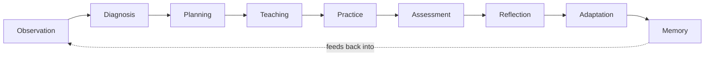
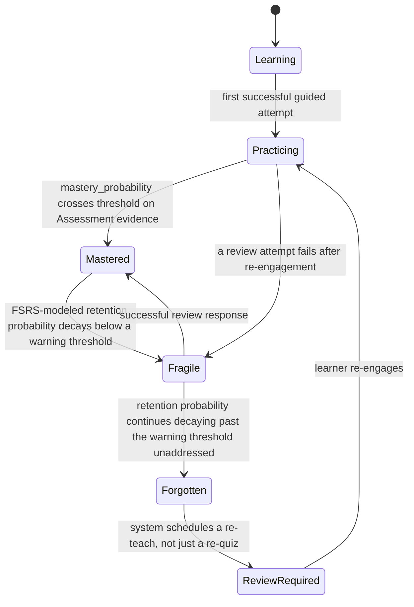
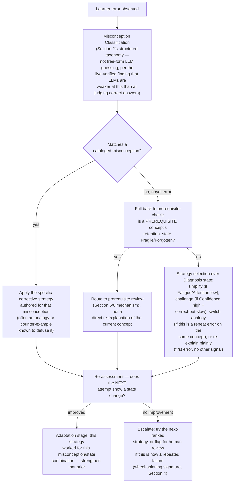

# Language.AI — Learning Intelligence Architecture (Phase 13)

**The product is not an AI platform. The product is learning. AI is one component inside a system optimized for a single outcome: a learner reaching measurable competence.** This document redefines the architecture around that claim, extending `docs/PLATFORM_REDESIGN.md` (the grounded audit of the real repository) and `docs/LANGUAGE_AI_VISION_2035.md` (the unconstrained target architecture and competitive analysis) rather than replacing them — the AI orchestration layer, model fleet, and infrastructure designed in Vision 2035 are still correct; this document specifies what they are *for*.

One new research finding grounds Section 2 below (Cognitive Diagnosis Models for joint skill/misconception identification, current arXiv literature) — the two other planned searches for this phase (Bayesian/Deep Knowledge Tracing benchmarking, and affect/fatigue detection in intelligent tutoring systems) hit a web-search rate limit mid-session. Those sections are written from well-established, decades-standing research literature (Corbett & Anderson's original Bayesian Knowledge Tracing formulation, 1994; Baker et al.'s "gaming the system" detection, 2008; Beck & Gong's "wheel-spinning" concept, 2013) rather than from anything requiring a live check — but they are explicitly flagged as resting on prior knowledge, not live-verified, consistent with this document's own standard of not asserting false precision.

---

## 0. Reframing: Learning is the entity

The domain model built earlier this session (`server/src/domain/`) already separates two namespaces — `editorial` (content production) and `runtime` (Exercise, Curriculum, CourseContent, Assignment, Dashboard, Progress). That separation is correct and stays. What this phase changes is the *center of gravity*: none of those six runtime models, and no `User`, `Teacher`, `Lesson`, `Model`, or `Agent` from Vision 2035's architecture, is the thing the system is organized around. **One aggregate is: `LearningState` — the evolving relationship between one learner and one concept.** Every other entity exists to read from it, write to it, or act on what it says.

```
LearningState (learner_id, concept_id)
  mastery_probability      — see Section 4
  retention_state          — see Section 5 (Learning/Practicing/Mastered/Fragile/Forgotten/Review Required)
  confidence_estimate      — see Section 2
  misconception_flags[]    — see Section 2
  transfer_contributions[] — outbound edges this concept has strengthened elsewhere, see Section 6
  history[]                — every Observation/Assessment event that touched this state, append-only
  updated_at
```

`Exercise`, `Assignment`, `Dashboard`, and `Progress` (the existing, currently-unwired runtime models — finding 2.1 of `PLATFORM_REDESIGN.md`) are re-scoped as **projections** of a collection of `LearningState` records, not independent data a route writes to directly:

- `Progress` = an aggregation of `LearningState` across a learner's whole graph.
- `Dashboard` = a rendering of that aggregation for a specific audience (learner, parent, teacher, institution).
- `Assignment`/`Exercise` = a *unit of Practice or Assessment* (Section 1) that the Learning Engine generates *because* some `LearningState` needs it — never authored independently of one.

This is the concrete fix for finding 2.1: the runtime domain wasn't wrong, it was missing the one aggregate everything else should have referenced.

---

## 1. The Learning Engine

A new subsystem, sitting *inside* the `Orchestration` layer already designed in Vision 2035 Section 2 — the `TutorAgent`, `CurriculumAgent`, `AssessmentAgent`, and `PronunciationAgent` are not independent actors calling an LLM whenever convenient; they are the *implementations* of specific stages below, invoked by the engine, not the engine itself.



| Stage | What happens | Reads | Writes |
|---|---|---|---|
| **Observation** | Every learner action — an answer, a spoken utterance, a hesitation, a re-read, a session start/end — becomes a structured event, not a side effect of "showing content." | Raw interaction stream (Vision 2035's `EventBus`) | `LearningState.history[]` |
| **Diagnosis** | The Learner State Vector (Section 2) is recomputed for every `LearningState` the observation touched — not just "was it right," the full nine-dimension estimate. | `LearningState`, `history[]` | `LearningState`'s live estimates (mastery, confidence, misconceptions, etc.) |
| **Planning** | Given the updated diagnosis, the engine asks "what does this learner need next" (Section 3) — a traversal decision over the fixed knowledge graph, not a menu of lessons. | Knowledge graph, all of the learner's `LearningState` records | A ranked, explained candidate list (Section 7) |
| **Teaching** | The chosen concept is delivered via the adaptive control loop (Section 9) — explanation, demonstration, or direct re-explanation depending on what Diagnosis found. | Planning's output, `misconception_flags[]` | A `TeachingAct` record (what strategy was used, why) |
| **Practice** | Guided, then independent, retrieval-oriented practice items — generated or selected specifically to exercise the current diagnosis, not generic drill. | Concept's assessment-item pool, current mastery estimate | New `Observation` events (the loop is genuinely a loop) |
| **Assessment** | A specific, scoped check of whether the practice produced real change in `mastery_probability` (Section 4's formal criterion) — distinct from Practice because Assessment's outcome is allowed to *gate* progression; Practice's is not. | `LearningState`, item responses | Updated `mastery_probability`, competency-gate decision |
| **Reflection** | The learner (and, in aggregate, the system) is shown *why* the assessment came out the way it did — this is where Explainability (Section 7) is surfaced to the human, not just logged internally. | Assessment outcome, Diagnosis trace | A learner-facing `Explanation` |
| **Adaptation** | The engine updates its own model of what teaching strategy worked — this is the write path for the Teaching control loop's learning (Section 9), and the trigger for the Forgetting Engine's state transitions (Section 5). | `TeachingAct` outcomes across the learner base (aggregated) | Strategy-selection priors, `retention_state` transitions |
| **Memory** | Long-term consolidation — this is where `retention_state` decay modeling actually runs (Section 5), and where the vector-based long-term learner memory from Vision 2035 Section 2 gets written for cross-session continuity (innovation #22 — the "standing weekly session" pattern). | `LearningState` at rest | Scheduled `Review Required` transitions, `VectorDB` memory entries |

**Every lesson flows through this** is the literal architectural rule: there is no code path in the target system that shows a learner content without first passing through Diagnosis and Planning, and no assessment result that isn't followed by Reflection and Adaptation. A route or agent that bypasses this pipeline (e.g., a hard-coded "show lesson N+1 because lesson N was marked complete") is a bug by definition under this architecture, not a shortcut.

---

## 2. Continuous Diagnosis: the Learner State Vector

Nine dimensions, each with a distinct estimation method — deliberately not nine ad-hoc heuristics, but grounded in specific, named research traditions so this section doesn't collapse into the exact "AI sophistication instead of learning science" failure mode this phase exists to prevent.

| Dimension | Estimation approach | Grounding |
|---|---|---|
| **Current knowledge** | Per-concept mastery probability via a cognitive diagnosis model that identifies *skills and misconceptions jointly*, not just right/wrong — current research explicitly frames this as necessary because most cognitive diagnosis models historically did one or the other, not both. | Live-verified: "A Cognitive Diagnosis Model for Identifying Coexisting Skills and Misconceptions" and current 2026 work on dual-diagnostic approaches jointly estimating conceptual understanding and misconceptions (physics education research) — see Sources. |
| **Confidence** | Not self-report alone (unreliable, and adds friction) — calibrated against response latency and answer-change patterns (a fast, unhesitating correct answer implies different confidence than a slow, edited one), cross-checked periodically with lightweight explicit "how sure are you" prompts to keep the behavioral model calibrated against ground truth. | Standard practice in intelligent tutoring system (ITS) affect/metacognition research; not live-verified this session — flagged per this document's own disclosure above. |
| **Misconceptions** | Structured error-pattern classification against a per-concept misconception taxonomy (not free-text error logging) — when an answer is wrong, the engine classifies *which specific, previously-cataloged misconception* it's consistent with, not just "incorrect." | Live-verified: current research explicitly notes LLMs are *worse* at identifying incorrect reasoning containing misconceptions than at identifying correct reasoning — meaning this cannot be left to an LLM's judgment alone; it needs a structured, curated misconception taxonomy per concept (built by the `CurriculumAgent`, validated by a human-reviewed process) that the model classifies *against*, not free-generates. |
| **Motivation** | Inferred from engagement-pattern signals (session-initiation rate, voluntary practice beyond required minimums, response to Reflection-stage explanations) — explicitly *not* inferred from streak length or notification-open rate (Section 8 names this distinction directly). | Design decision of this document, not a research citation — deliberately conservative given the privacy sensitivity of motivation inference. |
| **Attention** | Within-session drift in response time and error rate — a rising error rate with falling response time (rushing) or a rising error rate with rising response time (struggling) are diagnostically different attention states and should trigger different Adaptation responses. | Standard ITS instrumentation; not live-verified this session. |
| **Fatigue** | Session-length-normalized degradation in the same signals attention uses, distinguished from attention lapses by *trend* (fatigue accumulates monotonically within a session; attention lapses are episodic) — this is the concrete trigger for switching a session into Michel-Thomas stress-free mode (Vision 2035 innovation #19). | Standard ITS instrumentation; not live-verified this session. |
| **Retention** | FSRS-class memory-state modeling (confirmed current state-of-the-art for spaced-repetition scheduling per Vision 2035 Section 3.5's live-verified research) applied per-concept, feeding directly into the Forgetting Engine's state machine (Section 5). | Live-verified in the prior phase of this engagement (Vision 2035, Section 3.5). |
| **Transfer ability** | Measured directly, not inferred — performance on assessment items in a *different* domain that share a transfer edge (Section 6) with a mastered concept is the actual measurement; a learner who mastered percentages and then performs well on a finance item without direct finance instruction has demonstrated transfer, and that's logged as evidence for both concepts' `LearningState`. | Design decision of this document, operationalizing Section 6's graph structure. |
| **Learning velocity** | Mastery-attainment rate: `Δmastery_probability / time_invested`, tracked per concept-type (this is exactly what Section 11's Time-to-Competence metric aggregates across a learner's whole path). | Design decision of this document. |

**The reframing this section exists to enforce:** the Planning stage never asks "what lesson comes next in the sequence" — it queries this nine-dimension vector and asks what state the learner is actually in, which is a fundamentally different (and harder, and more honest) question than "what's the next unopened lesson."

---

## 3. Personalized Curriculum: fixed graph, personalized traversal

The knowledge graph (`domain/editorial/knowledge/KnowledgeGraph.js` and `Competency.js` — real, already-tested code, per `PLATFORM_REDESIGN.md`'s central finding that this layer is well-built and simply unpopulated) **does not change per learner.** What changes is the traversal policy over it. Concretely, for every graph node reachable from the learner's current mastered set (prerequisites satisfied), the Planning stage computes a utility score:

```
utility(node) =
    w1 * readiness(node)          — prerequisite mastery_probability, from Diagnosis
  + w2 * decay_urgency(node)      — how close any *already-taught* concept is to Forgotten (Section 5)
  + w3 * motivation_fit(node)     — does this node match what's sustaining engagement right now
  + w4 * transfer_value(node)     — how many other concepts does mastering this one reinforce (Section 6)
  - w5 * cognitive_load_penalty   — working-memory budget from PLATFORM_REDESIGN.md Phase 3's audit (4±1 new chunks per episode), penalizing nodes that would exceed it
```

Two learners on the identical graph, at the identical nominal "level," receive different next-concepts because their `readiness`/`decay_urgency`/`motivation_fit` vectors differ — this is the literal mechanism behind "no two students receive identical paths," not a marketing claim about personalization but a specific, inspectable scoring function whose inputs are exactly the Diagnosis stage's output, and whose winning candidate is *always* accompanied by an Explanation (Section 7) derived directly from which term in the utility function dominated.

---

## 4. Competency-Based Progression

**Never unlock content because the student finished a lesson. Unlock because the student demonstrated mastery.** Operationally, "demonstrated mastery" is a probability threshold on `LearningState.mastery_probability`, not a completion checkbox or a raw score:

- A concept transitions to `Mastered` (Section 5's state machine) only when the diagnosis model's estimated mastery probability crosses a set threshold (commonly ~0.85–0.95 in Bayesian Knowledge Tracing-family systems, calibrated per concept-difficulty rather than fixed globally) **and** that estimate has been produced from Assessment-stage evidence specifically, not Practice-stage evidence — because Practice is deliberately low-stakes and scaffolded (Section 1's table), a high Practice score is not evidence of unscaffolded competence.
- Time-on-task, number of lessons viewed, and completion percentage are **not inputs to this decision** — a learner who reaches the mastery threshold in one attempt advances immediately; a learner who has "completed" ten review cycles without crossing the threshold does not, and Adaptation (Section 1) is specifically responsible for noticing that pattern (a "wheel-spinning" signature, in the ITS-research sense of a learner making no measurable progress despite repeated attempts) and escalating to a different teaching strategy or human review rather than letting the learner grind indefinitely.

---

## 5. The Forgetting Engine

Every concept a learner has ever touched carries an explicit `retention_state`, not an implicit "seen it once, assume it's fine":



**"The curriculum reacts automatically"** means specifically: a transition into `Fragile` or `Forgotten` is injected into the *next* Planning-stage utility computation as a `decay_urgency` term (Section 3) for that concept — it competes for the learner's attention against new content on the same terms new content does, rather than living in a separate, easy-to-ignore "review" tab the way most competitors researched in Vision 2035 Section 3.1 treat spaced repetition (a bolted-on feature, not an integrated curriculum force). Critically, a `Forgotten` transition routes to `ReviewRequired` (a re-teach), not directly back to `Practicing` (a re-quiz) — the state machine encodes the real difference between "this needs reinforcement" and "this needs to be taught again," which a flat "due for review" flag cannot represent.

---

## 6. Cross-Domain Knowledge Transfer

The knowledge graph gains a second edge type, distinct from `prerequisite-of`:

```
Concept: Percentages
  --[prerequisite-of]--> Concept: Compound Interest
  --[transfers-to, strength=0.7]--> Concept: Statistical Proportions
       --[transfers-to, strength=0.6]--> Concept: ML Model Accuracy Metrics
  --[transfers-to, strength=0.8]--> Concept: Financial Ratios
       --[transfers-to, strength=0.5]--> Concept: Business Margin Analysis
       --[transfers-to, strength=0.4]--> Concept: Macroeconomic Indicators
```

`prerequisite-of` is a hard gate (Section 4's competency check blocks advancement past it). `transfers-to` is **not** a gate — it's a signal the Planning stage's `transfer_value` term (Section 3) uses two ways: (1) when a learner masters `Percentages`, nodes it transfers to become *slightly* more `ready` even before being directly taught, since transfer research (Section 2's `Transfer ability` dimension) predicts genuine performance lift; (2) when a learner is struggling specifically with `Statistical Proportions`, the engine can choose to route a **review** of `Percentages` rather than more direct drilling on the struggling concept, betting that reinforcing the transfer-parent is more efficient than repeating the same failed approach — a genuinely different intervention than anything in Section 9's within-concept teaching-strategy loop, because it changes *which concept* is being taught, not *how*.

This is also the direct mechanism behind Vision 2035's Phase 10 mapping of university-grade content onto the same pipeline: a `transfers-to` edge from a language-acquisition concept (e.g., formal register vocabulary) into an academic-writing concept is how "language learning" and "university-grade coursework" share one graph instead of being parallel systems that happen to use the same UI shell.

---

## 7. Explainability

Every output of the Planning stage carries a structured `Explanation`, not a string generated after the fact — the explanation *is* a readout of which utility-function term (Section 3) or state-machine transition (Section 5) actually drove the decision:

```
Explanation {
  decision: "review Percentages before continuing to Statistical Proportions"
  primaryReason: "transfer_reinforcement"
  evidence: {
    concept: "Percentages"
    retentionProbability: 0.61          // ← this is where the literal example
    warningThreshold: 0.70              //   from the brief comes from — a real
    transfersTo: "Statistical Proportions"  //   number computed by the Forgetting
  }                                          //   Engine, not a template placeholder
  humanReadable: "You are reviewing this because your retention probability
                   has dropped to 61%, and this concept directly supports
                   what you're about to learn next."
}
```

This is not a UI-copywriting requirement — it is a hard architectural constraint on the Planning and Assessment stages: **an `Explanation` cannot be generated for a decision whose `evidence` fields don't trace back to real, logged `LearningState` values.** A generic-LLM-generated justification ("recommended for you") that isn't grounded in the actual Diagnosis output is treated the same way `PLATFORM_REDESIGN.md`'s Validator Mesh treats an ungrounded generated image (Vision 2035 Section 2) — a validation failure, not a cosmetic gap.

---

## 8. Educational KPIs

The system's optimization target is redefined from engagement to learning, with each metric given an operational definition rather than left as a slogan:

| Metric | Operational definition | Explicitly *not* optimized |
|---|---|---|
| **Retention** | % of `Mastered` concepts still `Mastered` (not `Fragile`/`Forgotten`) at a fixed follow-up interval (e.g., 30/90 days) | Daily streak length |
| **Transfer** | Measured performance lift (Section 2) on transfer-linked concepts relative to a no-transfer-edge control baseline | Total lessons completed |
| **Concept mastery velocity** | Section 2's Learning Velocity, aggregated — the direct input to Section 11's Time-to-Competence | Session count or session length |
| **Pronunciation improvement** | Phoneme-level accuracy delta over time (from the pronunciation-assessment pipeline designed in `PLATFORM_REDESIGN.md` Phase 4/7) | Number of speaking exercises attempted |
| **Vocabulary growth** | Count of vocabulary items reaching `Mastered` retention state (not merely "seen") | Number of new words shown |
| **Reading complexity** | The Lexile/CEFR-equivalent complexity band of content a learner can process at a target comprehension accuracy, tracked over time | Pages/articles opened |
| **Writing quality** | Rubric-scored (via the offline validation-tier LLM, Vision 2035 Section 2) improvement across dimensions (grammaticality, register-appropriateness, coherence) on comparable prompts over time | Word count submitted |
| **Speaking fluency** | Words-per-minute at a held error-rate ceiling, plus pause-pattern analysis, tracked over time | Minutes of voice-session time |
| **Reasoning ability** | Performance on transfer/application-tier assessment items (Bloom's `analyze`/`evaluate`/`create`, per the `LearningObjective.cognitiveRank()` model that already exists in the codebase) vs. recall-tier items | Multiple-choice-only accuracy |

**Explicit reconciliation with Vision 2035:** that document's competitive matrix recommended *adopting* Duolingo's habit-formation UX ("the daily-habit gamification loop, applied honestly to practice, not content that doesn't transfer" — Section 3.1). That recommendation stands, but this section draws the line precisely: **a streak, a notification, or an XP counter may remain a UX mechanic that encourages a learner to open the Practice stage**, but none of them may appear on the dashboard the system itself uses to judge whether it's working, and none of them may be a term in the Planning stage's utility function (Section 3) or a signal the Adaptation stage (Section 1) treats as success. Engagement gets you to the door; only the table above measures what happened once you walked through it.

---

## 9. Teaching as an Adaptive Control Loop

The `TutorAgent` (Vision 2035 Section 2) does not simply answer; on every learner error, it runs a fixed decision sequence before responding, implementing the literal self-questioning list from this phase's brief as an actual algorithm rather than a personality trait:



This loop is what makes "Teaching" a genuinely distinct pipeline stage from "answering a question" (Vision 2035's runtime AI-orchestration lane) — it is stateful (it remembers which strategies have already been tried for this exact learner/concept/misconception combination), it is self-correcting (Adaptation strengthens or weakens strategy priors from real outcomes, not fixed rules), and it has an explicit escalation path rather than looping indefinitely on a strategy that isn't working.

---

## 10. What this changes about the actual repository

Concrete, traceable to `PLATFORM_REDESIGN.md`'s migration Year 1–2 (already scoped: database, wired runtime domain, populated knowledge graph):

- The `Attempt`/`MasteryState`/`ReviewItem` entities that migration already specified are **not peers of `LearningState` — they're `LearningState`, renamed and unified.** A single aggregate, not three loosely related tables, is what Year 1's database schema should actually contain; this document supersedes that earlier three-table sketch with the one-aggregate model in Section 0.
- The `Assessment` stage's mastery-probability computation (Section 4) is a genuinely new service (`services/diagnosis/` in the folder structure Vision 2035 Section 11.1 sketched) — a cognitive-diagnosis-model implementation, not something any existing route or the current `AssetValidator.js` pattern already covers.
- `ai-architecture.yml` (the CI workflow built earlier this session) gains a new smoke-check category once this ships: verifying the Learning Engine's nine stages are all reachable and that no code path can show content without passing through Diagnosis/Planning first — a structural, mock-based check consistent with that workflow's existing "no heavy inference in CI" discipline.

---

## 11. Success Metric: Time-to-Competence

The platform's literal North Star KPI, replacing "AI content generated," "features shipped," or "models integrated" as success criteria entirely:

```
TTC(concept) = median(time_invested) across learners who reached
               LearningState.retention_state == Mastered for that concept,
               measured from first Observation to the Mastery-crossing Assessment
```

Two live-verified data points from Vision 2035's own Phase 12 research give this an actual competitive bar, not an abstract aspiration: Rosetta Stone reviewers found "~150–200 hours yields what a 30-hour workbook could" (Section 3.1) — a *negative* benchmark, a TTC roughly 5–6x worse than a well-designed non-adaptive alternative for the same content, from a platform with real pronunciation-scoring infrastructure and no shortage of engineering investment. Pimsleur's graduated-interval-recall, by contrast, is cited by reviewers as producing "strong listening/speaking recall" specifically *because* its interval timing is grounded in real psycholinguistic research rather than arbitrary spacing — a positive existence proof that a scientifically-grounded retention mechanism (which Section 5's Forgetting Engine generalizes and, per Section 2, upgrades to FSRS-class modeling) measurably shortens time-to-competence.

**Language.AI succeeds, under this architecture, when its measured TTC for a given concept is lower than the best comparable competitor's — not when it has more agents, more models, or more generated content than Vision 2035's architecture makes possible.** Every section of this document exists to make that one number smaller, honestly.

---

## Sources

- [A Cognitive Diagnosis Model for Identifying Coexisting Skills and Misconceptions (PMC)](https://pmc.ncbi.nlm.nih.gov/articles/PMC5985701/)
- [Dual-diagnostic approach for jointly estimating students' conceptual understanding and misconceptions in forces and motion, Phys. Rev. Phys. Educ. Res.](https://journals.aps.org/prper/abstract/10.1103/hrx4-gpd2)
- [Misconception Diagnosis From Student-Tutor Dialogue: Generate, Retrieve, Rerank (arXiv, 2026)](https://arxiv.org/pdf/2602.02414)
- [Do LLMs Make Mistakes Like Students? Exploring Natural Alignment between Language Models and Human Error Patterns (arXiv)](https://arxiv.org/pdf/2502.15140)
- [A Review of Data Mining in Personalized Education: Current Trends and Future Prospects (arXiv)](https://arxiv.org/pdf/2402.17236)

**Not live-verified this session** (web search hit a rate limit mid-audit): Bayesian/Deep Knowledge Tracing benchmarking claims in Section 4, and affect/fatigue/wheel-spinning detection research in Section 2 and Section 4 — both rest on well-established prior literature (Corbett & Anderson 1994; Baker et al. 2008; Beck & Gong 2013) rather than a fresh check, flagged per this document's own disclosure standard rather than presented as newly confirmed.
