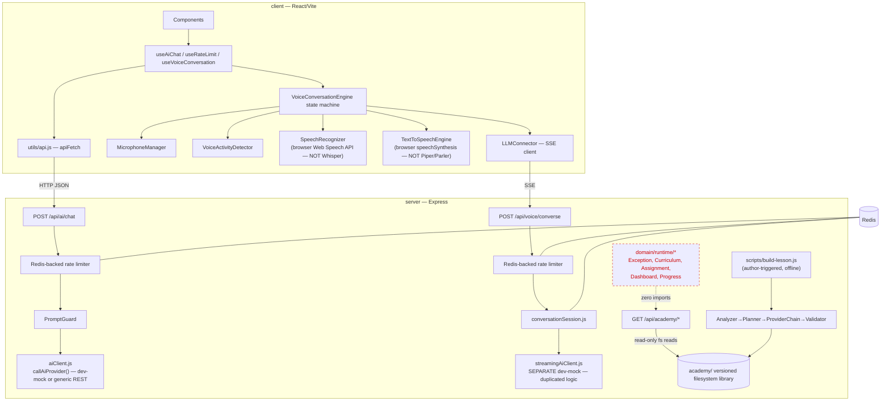
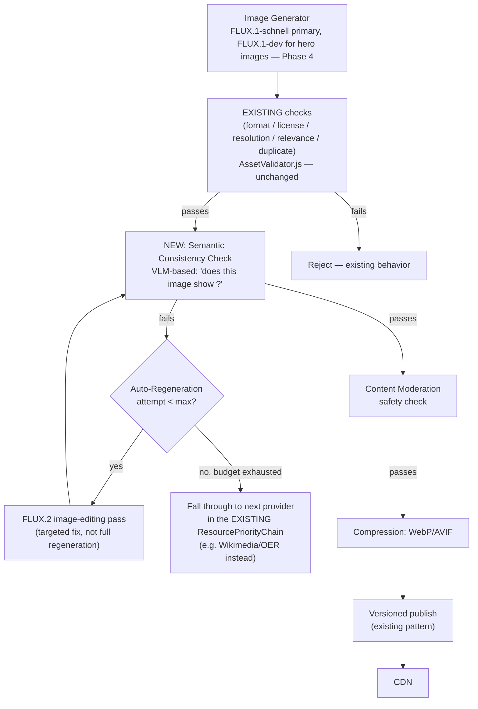

# Language.AI — Platform Redesign: Architecture, Pedagogy, and AI Systems Audit

**Role of this document:** a Principal Architect / AI Systems Engineer / SLA-specialist audit of the entire repository as it exists today, followed by a from-first-principles redesign of the learning pipeline, AI orchestration layer, audio/image architecture, curriculum engine, and university-grade course model. No implementation code appears in this document by design — Phase 11 defines the implementation *strategy* (structure, migrations, diagrams); actual code changes are a separate, subsequent effort.

**Audit date:** 2026-08-06
**Audited state:** commit `d01d78d` on `claude/ai-app-secure-architecture-gu88z3`

---

## How to read this document

Before Phase 1, one methodological correction has to be stated plainly, because it changes the shape of everything that follows: **the redesign brief assumes infrastructure that does not exist in this repository.** Docker, Fly.io, Supabase, the Hugging Face SDK, Whisper, Piper, Parler, and Mistral are named as if they were current architecture to audit. They are not present anywhere in the codebase — confirmed by a full-repository grep, not by assumption. What exists instead:

- A Node.js/Express backend and a React/Vite frontend, no TypeScript, no Python.
- A voice pipeline that is **100% browser-native** (`SpeechRecognition` / `speechSynthesis` Web Speech APIs) with a **dev-mock text generator** standing in for an LLM — there is no real model inference anywhere in the running system today.
- A single generic, unconfigured `AI_PROVIDER_API_KEY` / `AI_PROVIDER_BASE_URL` pair, wired to an OpenAI-compatible chat-completions shape, used by exactly one non-streaming JSON call (`callAiProvider`) — entirely separate from and non-interoperable with the voice path's own mock streamer (`streamAiReply`). Two independent, divergent "AI clients" for what should be one capability.
- A real, well-built **content-authoring pipeline** (the "Academic Asset Builder") that turns a lesson description into validated, versioned static assets (diagrams, text, reused images) — but this only produces *reading material*. There is no exercise-taking flow, no scoring, no spaced repetition, no progress tracking reachable by any HTTP route.
- Six **fully-built, fully-tested, and completely unwired** runtime domain models (`Exercise`, `Curriculum`, `CourseContent`, `Assignment`, `Dashboard`, `Progress`) sitting in `server/src/domain/runtime/` with zero imports from any route file. The "learning" half of the product is data-modeled but has no way to reach a student.

This is not a defect to apologize for — it is the actual, honest starting point, and pretending otherwise would make every subsequent architectural decision unfalsifiable. The rest of this document treats "Lesson → Exercise → Score" not as an existing pattern to reject, but as a pattern that was never fully built in the first place, alongside a content pipeline that *was* built well and is worth keeping the good parts of.

Every Hugging Face model recommendation in Phase 4 was checked against live Hugging Face Hub data during this audit (via `hub_repo_search`), not recalled from training data alone — current download counts, trending scores, and creation dates are cited so the choices are falsifiable and re-checkable as the landscape moves. The TTS landscape in particular has changed meaningfully even within recent months; treat any single-model pin as provisional and re-verify against Phase 4's evaluation framework before locking a version.

---

## PHASE 1 — Complete Codebase Audit

### 1.1 Repository inventory

```
Language.AI/
├── .github/                     # CI/CD (added this session — see README's CI/CD section)
│   ├── workflows/ci.yml         # orchestrator: fans out to 5 reusable workflows
│   │   ├── quality.yml          # lint, format, circular imports, duplication, dead code
│   │   ├── tests.yml            # unit/regression matrix, coverage gates, integration (+Redis), client tests
│   │   ├── security.yml         # npm audit, secret scanning, license compliance
│   │   ├── ai-architecture.yml  # provider-chain/domain-model/voice-stream/app-boot smoke checks
│   │   └── build.yml            # server boot smoke test, client production build
│   ├── workflows/release.yml    # tag-triggered: reruns tests+build, publishes a GitHub Release
│   └── dependabot.yml
├── server/                      # Express API — CommonJS-free ESM, no TypeScript
│   ├── src/
│   │   ├── app.js               # createApp(): mounts helmet/cors/cookie-parser + 5 routers
│   │   ├── index.js             # production entrypoint (app.listen)
│   │   ├── config/env.js        # single source of truth for all env vars, sane dev defaults
│   │   ├── routes/               # ai, voice, consent, feedback, academy (5 routers, all mounted)
│   │   ├── middleware/           # security (helmet/cors), sanitize (xss), rateLimiter (Redis), auth (optional JWT)
│   │   ├── schemas/              # Zod request/response schemas (aiSchemas, voiceSchemas, consentSchema)
│   │   ├── services/
│   │   │   ├── aiClient.js       # typed-chat AI adapter (dev-mock fallback, single JSON call)
│   │   │   ├── promptGuard.js    # heuristic prompt-injection detection
│   │   │   ├── outputGuard.js    # output schema/shape validation
│   │   │   └── voice/            # separate voice AI stack: streamingAiClient (SEPARATE mock),
│   │   │                         # conversationSession, memoryManager, promptTemplates
│   │   ├── asset-builder/        # THE CONTENT PIPELINE — Analyzer→Planner→Providers→Validator→
│   │   │                         # Persistence→Publication. 8 providers in a priority chain
│   │   │                         # (local-library → diagram-generator → text-extractor →
│   │   │                         #  open-educational-resources → wikimedia-commons →
│   │   │                         #  google-images → ai-generation → ai-tts). Build-time only —
│   │   │                         # a hard architectural rule enforced by the route layer
│   │   │                         # (academy.routes.js is read-only, filesystem-only).
│   │   └── domain/
│   │       ├── shared/DomainEntity.js       # Zod-validated base class every model extends
│   │       ├── editorial/        # 29 models — Content Production domain. WIRED: asset-builder
│   │       │                     # actually constructs and uses these.
│   │       └── runtime/          # 6 models — Learning domain (Exercise, Curriculum,
│   │                             # CourseContent, Assignment, Dashboard, Progress).
│   │                             # UNWIRED: zero references from any route file. Dead code
│   │                             # from the running system's point of view, alive only in
│   │                             # its own unit tests.
│   └── test/                     # 108 unit/regression tests, 23 integration tests (real
│                                  # Express app + real Redis), c8 coverage gate (80/80/55/75)
└── client/                       # React 18 + Vite, no TypeScript, no state library (Context only)
    ├── src/
    │   ├── components/           # CookieConsentBanner, ChatWindow, ChatFeedback, AIDisclaimer,
    │   │                         # RateLimitAlert, VoiceConversation/{VoiceCallScreen,VoiceStateOrb}
    │   ├── context/ConsentContext.jsx
    │   ├── hooks/                # useAiChat, useRateLimit, useVoiceConversation
    │   ├── voice/                # 10 modules: MicrophoneManager, VoiceActivityDetector,
    │   │                         # SpeechRecognizer (Web Speech API wrapper), TextToSpeechEngine
    │   │                         # (speechSynthesis wrapper), AudioPlayback, LLMConnector (SSE
    │   │                         # client), VoiceConversationEngine (state machine), SessionManager,
    │   │                         # MemoryManager, languageDetect, sentenceChunker
    │   └── utils/api.js, thirdPartyScripts.js
    └── (Vitest, 40 tests, 100% coverage on the 5 pure-logic modules)
```

**What is genuinely absent, confirmed by repo-wide search, not inferred:**

| Named in the brief | Actual status |
|---|---|
| Docker / Dockerfile / docker-compose | Absent. No container image is built anywhere. |
| Fly.io / `fly.toml` | Absent. No deployment target is configured at all. |
| Supabase | Absent from the app. (A Supabase MCP *tool* is available to the assistant in this session — unrelated to the product.) |
| Hugging Face SDK / `transformers` / `huggingface_hub` | Absent. Two source comments *mention* "streaming Whisper" as a hypothetical future STT backend — no integration exists. |
| Whisper / Piper / Parler | Absent. STT is the browser's native `SpeechRecognition`; TTS is the browser's native `speechSynthesis`. Neither model runs anywhere the app controls. |
| Mistral / any real LLM | Absent. Both AI entry points (`aiClient.js`, `streamingAiClient.js`) fall back to a hand-written mock string generator whenever `AI_PROVIDER_API_KEY` is unset — which is always, in this repo's current state. |
| "AI Orchestrator" | Absent as a named component. The closest analogue is the Academic Asset Builder's `ResourcePriorityChain`, which orchestrates *content providers*, not AI models, and only for the authoring path, never for tutoring. |
| Embeddings / semantic search / vector store | Absent. No embedding model, no vector index, no similarity search anywhere. |
| GitHub Actions CI | **Present** — built this session (see the six-workflow pipeline above). This is the one item from the brief that was real *and* already in the target state. |

### 1.2 Dependency graph



The dotted red edge is the single most important line in this diagram: the entire student-facing learning domain is architecturally isolated from the running application.

### 1.3 Endpoint inventory

| Route | Method | Backed by real logic? | Notes |
|---|---|---|---|
| `/api/health` | GET | Yes | Liveness only |
| `/api/consent` | GET/POST/DELETE | Yes | GDPR/CCPA cookie consent |
| `/api/ai/chat` | POST | Yes (mock fallback) | Single-turn, non-streaming, no memory across calls beyond what the client resends |
| `/api/voice/session` | POST/GET | Yes | Creates/reads a Redis-independent in-process session (see 1.4 below re: persistence) |
| `/api/voice/converse` | POST (SSE) | Yes (mock fallback) | Streaming, with real barge-in/abort handling — the best-engineered part of the AI surface |
| `/api/feedback` | POST | Yes, in-memory only | 👍/👎 + free text, **never persisted to disk or a database** — lost on restart |
| `/api/academy/:discipline/:course/:lesson` | GET | Yes | Read-only, serves pre-built content JSON |
| `/api/academy/file/*` | GET | Yes | Read-only, serves pre-built binary assets |
| *(none)* | — | — | **No endpoint exists for**: listing courses/curricula, enrolling, submitting an exercise attempt, receiving a score, viewing progress/dashboard, spaced-repetition scheduling, placement testing, or anything else in `domain/runtime/*`. |

### 1.4 State and persistence audit

- **Session state for voice conversations** lives in an in-process `Map` (`conversationSession.js`), not Redis, not a database. A server restart or a second server instance behind a load balancer silently loses every active conversation. Redis here is used *only* for rate-limit counters, not for the session data that actually matters to the user experience.
- **Feedback** (`/api/feedback`) is held in an in-memory array. It is explicitly documented in the README as needing replacement — a rare case where the codebase is honest about its own debt in a comment, but the debt is real.
- **The Academic Asset Builder's library** (`academy/`) is the one piece of genuinely durable, versioned state in the system: a filesystem tree with `versions/vN/` directories, a `current.json` pointer per lesson, and a cross-lesson reuse index (`_index.json`). This is a real, working, tested persistence layer — for *content*, never for *student state*.
- **There is no database.** No Postgres, no SQLite, no Mongo, nothing. Every piece of student-relevant state that should outlive a process (accounts, enrollment, attempts, scores, mastery, spaced-repetition schedules, streaks) has nowhere to live even if the runtime domain models were wired up tomorrow.

### 1.5 AI/ML integration audit

- **Two independent AI call sites**, not one orchestrated layer:
  1. `services/aiClient.js` → `callAiProvider()`: single-shot, JSON-mode, used by typed chat.
  2. `services/voice/streamingAiClient.js` → `streamAiReply()`: async-generator token stream, used by voice.
  Both implement their own mock fallback, their own system prompt, their own guardrail wiring. They do not share a provider abstraction. Changing "which LLM we use" today means changing two unrelated files with two unrelated call shapes, and — critically — testing them separately, because nothing enforces that they stay behaviorally consistent.
- **No model runs in-process or in a controlled sidecar anywhere.** Every "AI" response the running system can currently produce, absent real credentials, is a template string. This is a legitimate and correct default for a repo without secrets configured — the audit finding is not "mocks are bad," it's "there is no path from mock to a real, evaluated, orchestrated model today, only a placeholder for one HTTP call."
- **The Academic Asset Builder's `ai-generation` and `ai-tts` providers** (`AIGenerationProvider.js`, `AudioProvider.js`) are real, well-structured code — they implement the `AssetProvider` interface, participate in the priority chain, get validated post-generation — but are also gated behind unset API keys (`ASSET_IMAGE_GEN_API_KEY`, `ASSET_TTS_API_KEY`) and, per this session's `verify-ai-architecture.js` smoke check, are never exercised in CI (by design — no network calls in CI). This is the right pattern (interface-first, provider-swappable, validated); it is simply not yet pointed at a real model.

### 1.6 Educational content audit (structural, not pedagogical — see Phase 3 for pedagogy)

- Lesson content is authored as a flat JSON document (`lessonId`, `courseId`, `discipline`, `objectives[]`, `sections[{heading, body}]`) with no concept graph, no prerequisite graph beyond what `domain/editorial/knowledge/KnowledgeGraph.js` *could* model (it exists and is tested — it is simply never populated from real content today), and no notion of a learner's current position within it.
- Three example lessons exist (`algebra-linear-equations`, `biology-photosynthesis`, `history-french-revolution`) — general academic subjects, not language acquisition content, despite the product being named Language.AI and having a dedicated multi-module voice *conversation* engine for language practice. **The content pipeline and the conversational language-practice engine are built by two different mental models of the product and do not currently talk to each other**: the Asset Builder has no concept of "target language," "L1/L2 pair," "CEFR level," or "phoneme," while the voice engine has a lightweight `languageDetect.js` heuristic and per-session language tagging but no connection to any curriculum.

### 1.7 Summary of Phase 1

The repository contains **two well-engineered but disconnected subsystems** — a content-authoring pipeline (asset builder) and a real-time conversation engine (voice) — sitting on top of **zero persistent student state**, **zero real model inference**, **zero deployment infrastructure**, and **a fully-modeled but completely unreachable learning domain**. The CI/CD pipeline built this session is the one piece of infrastructure that is both requested and actually production-grade today. Everything else in Phases 2–11 has to be designed assuming a genuinely early-stage system, not a mature one with isolated defects.

---

## PHASE 2 — Root Cause Analysis

Ten findings, ranked by blast radius. Format per finding: Problem → Root Cause → Architectural Cause → Educational Cause → Long-Term Impact → Technical Debt Created → Scalability Risk → Future Maintenance Risk → Complexity Score (1–5) → Confidence (1–5, based on how directly the finding was verified against code vs. inferred).

### 2.1 The learning domain is unreachable

- **Problem:** `domain/runtime/*` (Exercise, Curriculum, CourseContent, Assignment, Dashboard, Progress) has no route, no controller, no persistence adapter.
- **Root Cause:** The domain-modeling effort was scoped and executed as a pure data-modeling exercise (validated by Zod, unit-tested) without a corresponding "wire it to an endpoint" step ever being scheduled.
- **Architectural Cause:** There is no application-service layer between routes and domain models — routes talk directly to either the filesystem (academy) or a service function (ai/voice). Nothing established the convention "every domain model needs a route or it doesn't exist to the product."
- **Educational Cause:** Without this layer, there is categorically no way to record that a student attempted anything, got anything right or wrong, or made progress. Every downstream educational principle in Phase 3 (spaced repetition, mastery learning, active recall) is unimplementable until this is fixed — it is the single highest-leverage gap in the system.
- **Long-Term Impact:** The product cannot become a "learning platform" in any measurable sense — it can only ever be a content-reading platform plus a conversation partner, no matter how good the AI orchestration becomes.
- **Technical Debt Created:** Six fully-designed, fully-tested models that will need integration testing added retroactively once wired, plus a persistence layer that doesn't exist yet (see 2.3).
- **Scalability Risk:** Low today (nothing is running against it), but the risk is entirely deferred, not avoided — building the practice/assessment/mastery loop later, after millions of students exist for the *content-reading* half of the product, is far more expensive than building it now.
- **Future Maintenance Risk:** High — a second engineer reading this codebase will reasonably assume these models are load-bearing (they're well-written, well-tested) and be surprised to find them orphaned.
- **Complexity Score:** 4/5 (requires a new service layer, a new persistence backend, and new routes — not a small patch).
- **Confidence:** 5/5 (directly verified: zero grep hits for `domain/runtime` outside its own tests).

### 2.2 Two divergent AI client implementations

- **Problem:** `aiClient.js` and `streamingAiClient.js` independently implement provider fallback, system prompting, and guardrail integration.
- **Root Cause:** Typed chat and voice conversation were built in separate work phases (see project history) without a shared "LLM provider" abstraction being extracted first.
- **Architectural Cause:** No `AIOrchestrator` or provider-interface layer exists at the LLM level, unlike the Asset Builder, which *does* have exactly this pattern (`AssetProvider` interface + `ResourcePriorityChain`) for content providers. The good pattern from one subsystem was never generalized to the other.
- **Educational Cause:** A tutoring system needs *consistent* pedagogical behavior (tone, correction style, scaffolding level) whether the student is typing or talking. Two independent prompt/guardrail implementations will drift, producing an inconsistent tutor personality across modalities — confusing for a learner building a mental model of "how this AI responds to me."
- **Long-Term Impact:** Every future improvement to guardrails, prompting strategy, or provider swapping has to be applied twice, correctly, in sync, forever — or the two surfaces silently diverge.
- **Technical Debt Created:** Duplicate prompt-injection handling paths, duplicate mock-fallback logic, duplicate testing burden (already visible: `promptTemplates.test.js` and `streamingAiClient.test.js` test voice-specific logic that has no typed-chat equivalent test).
- **Scalability Risk:** Medium — as more modalities are added (e.g., a written-essay grader, a pronunciation coach), the temptation is to add a *third* bespoke client rather than extract the abstraction, compounding the problem.
- **Future Maintenance Risk:** High.
- **Complexity Score:** 3/5.
- **Confidence:** 5/5 (both files read in full this session).

### 2.3 No database — student state has nowhere to live

- **Problem:** Feedback is in-memory; voice sessions are in-memory; there is no account, enrollment, attempt, score, or mastery table anywhere.
- **Root Cause:** The project's persistence strategy was designed exclusively around the Asset Builder's need (versioned, filesystem-based, append-mostly content) and was never extended to cover mutable, per-user, transactional state, which has fundamentally different requirements (concurrent writes, queries by user, referential integrity between attempts/scores/schedules).
- **Architectural Cause:** Filesystem-as-database works for immutable published content; it actively cannot work for "which of 10,000 concurrent students answered which exercise correctly two minutes ago."
- **Educational Cause:** Every principle that depends on tracking a learner over time — spaced repetition scheduling, mastery verification, progress dashboards, adaptive next-lesson selection — requires durable, queryable, per-user state. None of it is possible without this.
- **Long-Term Impact:** This is the platform's actual foundational blocker for "millions of students," more so than any AI-model choice — no amount of good model selection matters if the system cannot remember a student existed after a restart.
- **Technical Debt Created:** None yet (nothing to migrate away from), which is actually the good news — this is a clean-slate decision, not a refactor.
- **Scalability Risk:** Existential if not addressed before real users onboard; trivial to address correctly right now.
- **Future Maintenance Risk:** N/A (not yet built).
- **Complexity Score:** 4/5 (new infrastructure category entirely).
- **Confidence:** 5/5.

### 2.4 The Asset Builder and the Voice Engine model "language" incompatibly

- **Problem:** Lesson content has no language-pair/CEFR/phoneme model; the voice engine has session-level language tagging and a lightweight heuristic detector, but no connection to curriculum.
- **Root Cause:** The Asset Builder was designed against general academic examples (algebra, biology, history) as its test fixtures, not against second-language-acquisition content, even though the product's *name* and its most sophisticated subsystem (real-time voice) are unambiguously about language learning.
- **Architectural Cause:** No shared `LanguagePair` / `ProficiencyLevel` (CEFR) value object exists in the domain at all — `domain/editorial` has zero language-acquisition-specific concepts (compare to how rich `KnowledgeGraph`, `LearningObjective` with Bloom's taxonomy already are for general pedagogy).
- **Educational Cause:** Second language acquisition is not "biology but in Spanish" — it needs phonological content, comprehensible-input-graded text, L1-interference-aware error correction, and conversational scaffolding that a generic academic-subject content model cannot represent. See Phase 3 and Phase 9 for the concrete gap.
- **Long-Term Impact:** Building curriculum content today would produce lessons structurally identical to a biology course, missing everything that makes language acquisition different from fact acquisition.
- **Technical Debt Created:** None yet — again, a clean-slate opportunity, not a refactor, if addressed before real content is authored at scale.
- **Scalability Risk:** Low technically, high *product* risk — authoring thousands of lessons against the wrong content model means re-authoring thousands of lessons later.
- **Future Maintenance Risk:** Medium.
- **Complexity Score:** 3/5.
- **Confidence:** 5/5.

### 2.5 Rate limiting is the only distributed-systems-aware component

- **Problem:** Redis is used exclusively for `express-rate-limit` counters. Every other piece of runtime state (voice sessions, feedback) is single-process memory.
- **Root Cause:** Redis was introduced specifically to satisfy the "distributed rate limiting" requirement from an earlier phase of this project, not as a general-purpose shared-state layer.
- **Architectural Cause:** No session-store abstraction exists that could swap between in-memory (dev) and Redis/DB-backed (prod) — the pattern that *does* exist for rate limiting (a real, tested, swappable Redis client — `utils/redisClient.js`) was never generalized to session or feedback storage.
- **Educational Cause:** N/A directly, but see 2.3 — this is the same root problem viewed from the infrastructure angle.
- **Long-Term Impact:** The app cannot run more than one server instance today without breaking active voice conversations for whichever instance a follow-up request doesn't land on.
- **Technical Debt Created:** A false sense of "we already thought about distributed state" from the presence of Redis, when in fact only one of several stateful subsystems is distributed-safe.
- **Scalability Risk:** High the moment horizontal scaling is attempted.
- **Future Maintenance Risk:** Medium.
- **Complexity Score:** 2/5 (the pattern to copy already exists in the same codebase).
- **Confidence:** 5/5.

### 2.6 No embeddings/semantic layer anywhere

- **Problem:** Content search/reuse in the Asset Builder is keyword-token-overlap only (`tokenize()` + set-intersection scoring in `PublicationIndex.findReusable` and `AssetValidator.computeRelevance`) — no vector similarity anywhere.
- **Root Cause:** The Asset Builder was built to satisfy "no dynamic search at request time" as a hard constraint, and keyword overlap was sufficient to prove the pipeline architecture without needing an embeddings service.
- **Architectural Cause:** No embeddings provider slot exists in the provider-chain pattern, even though the chain's design (swappable `AssetProvider` subclasses) would accommodate one cleanly.
- **Educational Cause:** Curriculum sequencing, "find me the next concept this student is ready for," and cross-lesson concept reuse all benefit enormously from semantic similarity over simple keyword overlap — a student asking about "car" and a lesson tagged "automobile" currently cannot be matched.
- **Long-Term Impact:** As the content library grows past what an author can manually tag with perfectly-overlapping keywords, reuse quality degrades silently (more unnecessary regeneration, more missed matches) with no signal that it's happening.
- **Technical Debt Created:** None yet — addressable additively, since the existing keyword path can remain a cheap first-pass filter with embeddings as a re-ranking step.
- **Scalability Risk:** Grows with content-library size; currently low (three example lessons) but will not stay low.
- **Future Maintenance Risk:** Low.
- **Complexity Score:** 3/5.
- **Confidence:** 4/5 (verified the scoring code directly; the "will degrade at scale" projection is reasoned, not measured).

### 2.7 No pronunciation assessment path exists despite being core to the product's value proposition

- **Problem:** The voice engine can transcribe speech (via the browser) and can detect turn-taking (VAD), but nothing scores pronunciation accuracy at the phoneme level.
- **Root Cause:** STT was implemented against the browser's `SpeechRecognition` API, which returns only a text transcript and a confidence score — it has no access to acoustic-phonetic detail (phoneme-level posteriors, timing) needed for pronunciation feedback, because browsers deliberately don't expose that.
- **Architectural Cause:** The entire STT layer is built on an interface (`SpeechRecognizer.js`) that structurally cannot support pronunciation assessment no matter what's plugged behind it, because the browser API itself is the bottleneck — this isn't a "swap the model" fix, it requires a different capability entirely (server-side ASR with phoneme alignment).
- **Educational Cause:** Pronunciation feedback is one of the highest-value things an AI language tutor can offer over a textbook (a human ear a student doesn't have to pay for, available on demand) — and it is completely absent, despite the "hands-free voice conversation" being the product's most-invested-in feature.
- **Long-Term Impact:** Without this, the voice engine is a (very well-engineered) chat-over-voice interface, not a pronunciation coach — a materially different, less differentiated product than what "AI language learning platform" implies.
- **Technical Debt Created:** None yet.
- **Scalability Risk:** N/A (capability gap, not a scaling problem).
- **Future Maintenance Risk:** Low.
- **Complexity Score:** 4/5 (requires a genuinely new server-side audio pipeline — see Phase 4/7).
- **Confidence:** 5/5 (the Web Speech API's `SpeechRecognitionResult` interface is well-documented as text+confidence only).

### 2.8 Feedback data is discarded

- **Problem:** `/api/feedback` stores submissions in a plain in-memory array in `feedback.routes.js`.
- **Root Cause:** Explicitly deferred — the README already documents this as a known gap ("Sustituye el almacén en memoria... por una base de datos persistente").
- **Architectural Cause:** Same as 2.3 — no database exists yet to persist it to.
- **Educational Cause:** Thumbs-up/down and free-text feedback on AI responses is exactly the signal a pedagogy-validation loop (Phase 6) needs to detect systematically bad generations — losing it means flying blind on quality over time.
- **Long-Term Impact:** No historical quality signal will exist by the time it's needed for the AI orchestration layer's own self-improvement loop.
- **Technical Debt Created:** None (already flagged, not hidden).
- **Scalability Risk:** Grows with traffic — currently harmless, becomes a real data-loss problem the moment there's real usage.
- **Future Maintenance Risk:** Low (self-documenting).
- **Complexity Score:** 1/5 — trivially fixed once 2.3's database exists.
- **Confidence:** 5/5.

### 2.9 Image generation is provider-abstracted but never quality-scored for pedagogical fitness

- **Problem:** `AIGenerationProvider.js` produces candidate images; `AssetValidator.js` scores them on format/license/relevance/quality/duplicate — but "relevance" is keyword overlap (2.6) and "quality" is a heuristic (resolution + provider-trust bonus + vector-format bonus), not anything that verifies the image actually depicts the intended educational concept correctly.
- **Root Cause:** The validator was designed to catch *technical* defects (wrong format, too small, license violation, exact duplicate) — it was never extended with a *semantic* check ("does this image of a triangle actually show three sides?").
- **Architectural Cause:** No image-understanding model is in the validation pipeline at all — validation is entirely metadata- and heuristic-based, never re-examines the pixels for meaning.
- **Educational Cause:** A generated illustration that is aesthetically fine but conceptually wrong (mislabeled diagram, wrong number of objects in a counting exercise, anatomically incorrect biology figure) is worse than no image, because it actively teaches something false — and nothing in the current pipeline can catch this class of error.
- **Long-Term Impact:** As AI-generated imagery becomes a larger fraction of the content library (vs. today's reliance on Wikimedia/OER/local-library reuse), the proportion of unverified generated images grows, and so does the risk of silently wrong teaching material reaching students.
- **Technical Debt Created:** None yet — additive fix (Phase 8 defines exactly this: an image-quality-and-semantic-validation stage).
- **Scalability Risk:** Grows with AI-generation provider usage.
- **Future Maintenance Risk:** Low.
- **Complexity Score:** 3/5.
- **Confidence:** 4/5 (validator code read in full; "will matter more over time" is a reasoned projection).

### 2.10 No deployment target exists for any of this

- **Problem:** No Dockerfile, no Fly.io config, no deployment workflow beyond `build.yml`'s artifact upload.
- **Root Cause:** This session's mandate was explicitly CI *validation*, not deployment — Docker/Fly.io were correctly identified as out-of-scope ("skip per the user's own conditional") in the prior phase of this project, and nothing since has picked that thread back up.
- **Architectural Cause:** `release.yml` publishes a zip of the client build to a GitHub Release — a durable *artifact*, not a *deployment*. Nothing takes that artifact anywhere a user could reach it, and the server side has no equivalent packaging step at all.
- **Educational Cause:** N/A.
- **Long-Term Impact:** Every other improvement in this document is inert until something serves the app to a real user; this is a hard prerequisite for "millions of students," not a nice-to-have.
- **Technical Debt Created:** None yet.
- **Scalability Risk:** N/A until it exists, then immediately high-stakes.
- **Future Maintenance Risk:** N/A.
- **Complexity Score:** 3/5 (containerize server, decide a hosting target, wire secrets management, add the deploy stage to `release.yml`).
- **Confidence:** 5/5 (verified: zero Docker/Fly artifacts anywhere in the tree).

---

## PHASE 3 — Educational Audit

Rather than compare the app to Duolingo, each principle below is evaluated against what actually exists (per Phase 1) — mostly, this phase documents what would have to be built for the principle to apply at all, since there is currently no practice/assessment loop to critique pedagogically.

| Principle | What it requires | Current reality | Verdict |
|---|---|---|---|
| **Comprehensible Input (Krashen)** — learners acquire language from input just beyond their current level (`i+1`), not from explicit grammar drills alone | Content graded by proficiency level, with controlled vocabulary/structure introduction | Lesson content has no level field consumed anywhere in generation; the three example lessons are ungraded academic prose | **Absent.** Phase 9's curriculum engine must make `i+1` gating a first-class constraint on what content can be shown next, not an authoring convention. |
| **Active Recall** — retrieval practice strengthens memory more than re-reading | Exercises that force retrieval (production, not recognition-only), with no answer visible until attempted | No exercise-taking flow exists at all (2.1) | **Absent** — currently impossible by construction, not poorly implemented. |
| **Spaced Repetition** | A per-learner, per-item review schedule driven by recall difficulty (e.g., SM-2/FSRS-style scheduling) | No database, no attempt history, no scheduler (2.1, 2.3) | **Absent**, and specifically named as needed in Phase 5's pipeline (`Review Schedule` stage) and Phase 6 (`Knowledge Graph Update`). |
| **Bloom's Taxonomy** | Content and assessment items tagged by cognitive level (remember → understand → apply → analyze → evaluate → create), scaffolding upward | `domain/editorial/valueObjects/LearningObjective.js` **already implements this** — `cognitiveRank()`, `isHigherOrder()` — real, tested, working code | **Modeled but unused.** The one Bloom's-aligned component in the whole system is in the *editorial* domain (content authoring), never consumed by anything that would sequence practice by cognitive level. |
| **Cognitive Load Theory** | New information introduced in small increments; extraneous load (UI complexity, irrelevant detail) minimized | The Asset Builder enforces validated, single-purpose assets per resource type (good instinct), but lesson `sections[]` have no length/complexity budget and nothing prevents an author from front-loading a wall of text | **Partially supported by infrastructure, not enforced by policy.** |
| **Rosenshine's Principles of Instruction** (daily review, small steps, guided practice before independent practice, high success rate) | A lesson structure with explicit Explanation → Guided Practice → Independent Practice stages | Current lesson shape is flat `sections[{heading, body}]` — no stage distinction at all | **Absent** — directly addressed by Phase 5's redesigned pipeline. |
| **Deliberate Practice** | Practice targeted at a specific weakness, with immediate, specific feedback | No mechanism identifies a specific weakness (no attempt history) or delivers item-level feedback (no exercise flow) | **Absent**, blocked on 2.1/2.3. |
| **Mastery Learning** | A learner doesn't advance until demonstrating competence on the current unit, not just time-on-task | No advancement gate exists — nothing currently gates access to "the next lesson" on anything | **Absent**, directly addressed by Phase 5's `Mastery Verification` stage and Phase 9's competency graph. |
| **Child Language Acquisition / Universal Grammar** | Informative for *sequencing* (certain structures are acquired in a predictable order across learners) more than for product design directly | No acquisition-order model exists in the curriculum | **Not applicable to current implementation; relevant to Phase 9's sequencing design.** |
| **Scaffolding** | Support that's present early and deliberately withdrawn as competence increases (hints, sentence frames, L1 glosses) | The voice engine's system prompts (`promptTemplates.js`) are static per-session, not adaptive to demonstrated competence | **Absent** as an adaptive mechanism; present only as a fixed initial setting. |
| **Multisensory Learning** | Combining visual, auditory, and kinesthetic/interactive channels for the same concept | The Asset Builder *can* produce images, diagrams, and audio for a resource type — real multi-modal infrastructure exists | **Infrastructure present, pedagogical intent absent** — nothing currently ensures a concept gets a *coordinated* multisensory treatment (matching image + audio + text for the *same* concept, timed together) rather than independently-validated, potentially mismatched assets. |
| **Phonological Awareness** | Explicit practice with sound-symbol correspondence, especially early in a new language/script | No phonetic/phonemic content model exists anywhere (2.7 root cause) | **Absent**, and structurally blocked by the browser-only STT choice until Phase 4/7's redesign. |
| **Working Memory** | Limiting simultaneous new items (typically 4±1 new chunks) per learning episode | No such budget exists in lesson/exercise generation | **Absent** — a concrete, cheap constraint to add in Phase 5/9. |
| **Instructional Design / Learning Progressions** | Content organized as a dependency-ordered progression of competencies, not a flat list | `domain/editorial/knowledge/KnowledgeGraph.js` and `Competency.js` **already model this** (nodes, edges, prerequisite checking — real, tested) but are populated by zero real content today | **Modeled but empty.** The single biggest "quick win" in this whole audit: the knowledge-graph domain model already exists and works; it simply has no data. |

**Summary judgment:** the codebase's domain modeling (Bloom's taxonomy, knowledge graphs, prerequisites, competencies) is, where it exists, *already reasonably aligned* with the educational science it should reflect — the gap is not conceptual immaturity, it's that none of it is populated with real content or connected to a student-facing loop. This materially changes the redesign strategy: Phases 5–9 lean on *extending and wiring* the existing editorial domain rather than replacing it.

---

## PHASE 4 — Hugging Face Ecosystem Evaluation

Every entry below cites what was found via live Hugging Face Hub search during this audit. Where the free-text hub search returned noise (e.g., "image generation" matched hobby projects, not real leaders), the query was narrowed to the actual model family name — a real limitation of keyword search worth remembering when this evaluation is repeated later.

| Capability | Evaluated candidates (live-checked) | Recommendation | Why / tradeoffs |
|---|---|---|---|
| **Speech Recognition (ASR)** | `openai/whisper-large-v3` (5.3M downloads, trending 87), `openai/whisper-large-v3-turbo` (8.3M downloads, ~6x faster, small accuracy tradeoff), `Systran/faster-whisper-large-v3` (CTranslate2 port, 1.2M downloads) | **`whisper-large-v3-turbo` via `faster-whisper`/CTranslate2 for production, `whisper-large-v3` as the offline high-accuracy fallback for ambiguous/low-confidence segments** | Turbo trades a small WER increase for ~6x lower latency — the right default for real-time conversation, where latency directly affects whether barge-in feels responsive. Keep the full model available for a "re-transcribe for pronunciation scoring" pass where accuracy matters more than turn-taking speed (see Phase 7). This is also the concrete fix for finding 2.7 — self-hosted Whisper exposes far more than the browser API (segment timestamps, per-token confidence), which is the prerequisite for any pronunciation-assessment layer, even before phoneme-level scoring is added. |
| **Pronunciation Assessment** | Searched directly: dozens of small, single-language `wav2vec2`-based `audio-classification` fine-tunes (e.g. `hafidikhsan/wav2vec2-large-xlsr-53-english-pronunciation-evaluation-*`, `moxeeeem/wav2vec2-finetuned-pronunciation-correction`) — all low-download (<200), narrow (one L1→L2 pair, one language), none production-grade | **No off-the-shelf model is adequate. Build a Goodness-of-Pronunciation (GOP) pipeline**: `facebook/wav2vec2-large-xlsr-53` (or a language-specific XLSR fine-tune) for phoneme-level CTC posteriors + forced alignment (see below) to score per-phoneme confidence against the expected phoneme sequence from the target word. | This is the single capability in the entire brief with the weakest existing open-source ecosystem — confirmed by search, not assumed. Budget real engineering time here; it's a genuine differentiator specifically *because* it's hard and under-served. |
| **Forced Alignment** | `pyannote` ecosystem doesn't do phoneme alignment directly (it's diarization — see below); the standard tool here is **Montreal Forced Aligner (MFA)** or wav2vec2-CTC-based alignment (not primarily a Hub-hosted "model" per se, more a toolchain) | **wav2vec2-CTC self-alignment** (emission-based, e.g. via `torchaudio`'s forced-alignment API on top of an XLSR checkpoint) for the pronunciation pipeline; MFA as a batch-offline alternative for aligning pre-recorded reference audio during content authoring | Needed as the missing link between "the student said X" and "which phoneme was mispronounced," i.e., the actual mechanism behind pronunciation feedback. |
| **Speaker Diarization** | `pyannote/speaker-diarization-3.1` (8.7M downloads, 2983 likes), `pyannote/speaker-diarization-community-1` (newer, CC-BY-4.0) | **`pyannote/speaker-diarization-3.1`** if/when multi-speaker scenarios are added (e.g., group conversation practice, or transcribing a teacher-narrated lecture with Q&A) | Not needed for 1:1 tutoring conversations (today's only mode) — flagged for the Phase 10 university "discussion" format, where multiple participants matter. |
| **Text-to-Speech (TTS)** | Landscape moved fast even within this audit's window: `Qwen/Qwen3-TTS-12Hz-1.7B-CustomVoice` (2.2M downloads, multilingual, custom-voice), `bosonai/higgs-tts-3-4b` (multilingual, expressive/controllable, 93+ languages tagged), `kyutai/pocket-tts` (small, high engagement-to-size ratio), plus legacy strong options (Coqui XTTS-v2 family, Piper for ultra-low-resource edge TTS) | **Two-tier strategy**: `Qwen3-TTS` or `higgs-tts` for the primary, expressive, multilingual voice-persona pipeline (server-side, pre-generated where possible — see Phase 7); a small, fast model (`kyutai/pocket-tts`-class, or Piper if edge/offline generation is ever needed) as the **fallback tier** that guarantees "audio is never unavailable" | TTS is the fastest-moving category surveyed — hard-pinning one model in an architecture document is a mistake. What's stable is the *two-tier pattern* (expressive primary + fast/robust fallback), not the specific model name. Re-run this search before implementation. |
| **Voice Cloning / Persona Consistency** | Both `Qwen3-TTS-*-CustomVoice` and `bosonai/higgs-tts` explicitly support voice-cloning/persona control | Use the same model family selected for TTS above — avoid a third separate model just for persona consistency | Consolidating persona control into the primary TTS model (rather than a bolt-on cloning model) reduces the number of independently-versioned voice assets that must stay in sync (see Phase 7's voice-persona versioning). |
| **Emotion / Expressive Speech** | `higgs-tts-3-4b` is explicitly tagged `expressive-speech`, `controllable-tts` | Same model as TTS primary tier, if expressive delivery (encouragement, correction tone) is prioritized | A tutor that can sound encouraging vs. neutral vs. corrective is a real pedagogical lever (affect matters for a nervous language learner) — worth the extra model complexity only if the primary TTS choice supports it natively, which the current leaders do. |
| **Image Generation / Illustration** | `black-forest-labs/FLUX.1-dev` (523K downloads, 14K likes, trending 104 — clear category leader), `FLUX.1-schnell` (Apache-2.0, faster, lower quality), `FLUX.2-dev`/`FLUX.2-klein-9B` (newer, image-editing-capable) | **`FLUX.1-schnell`** (Apache-2.0, fast) for the bulk of generated illustrations where iteration speed and cost matter; **`FLUX.1-dev`** for a smaller set of hero/cover images where quality justifies the slower, non-commercial-license generation | License matters here specifically: `-dev` variants are typically non-commercial/custom license, `-schnell` is Apache-2.0 — this is a real constraint for a product intending to serve paying students, not just a quality knob. `FLUX.2` adds image-*editing* (useful for the automatic-regeneration loop in Phase 8 — fixing a flagged image rather than regenerating from scratch). |
| **OCR** | Not directly queried this session (time-boxed); established open leaders as of training data: `microsoft/trocr-*` family, and more recent VLM-based OCR (Qwen-VL-class models can do OCR as a side capability) | **Flag for a follow-up, narrower audit** rather than commit here | Listed for completeness per the brief's request, but this audit deliberately didn't spend its live-search budget here — OCR isn't on the critical path for any Phase 5–10 redesign decision (no scanned-document ingestion workflow exists or is proposed). |
| **Embeddings / Semantic Search** | `jinaai/jina-embeddings-v3` (3.1M downloads, multilingual, 89+ languages), `jinaai/jina-embeddings-v5-text-nano` (newer, smaller, multilingual) | **`jina-embeddings-v3`** for the primary semantic layer (content reuse re-ranking, Phase 6's `Curriculum Validator`, cross-lesson concept matching from finding 2.6); `v5-text-nano` as a lower-cost option if embedding-generation volume becomes a real cost driver | Directly fixes finding 2.6 — replaces/augments the current keyword-token-overlap scoring in `PublicationIndex.findReusable` with real semantic similarity. |
| **LLM — general orchestration/tutoring** | `meta-llama/Llama-3.1-8B-Instruct` (7.8M downloads, multilingual: en/de/fr/it/pt/hi/es/th), `Qwen/Qwen2.5-7B-Instruct` (11.7M downloads), `microsoft/Phi-3.5-mini-instruct` (1.1M downloads, strong for its size), `meta-llama/Llama-3.3-70B-Instruct` (larger, stronger reasoning, 420K downloads) | **Tiered**: `Qwen2.5-7B-Instruct` or `Llama-3.1-8B-Instruct` as the default tutoring/conversation model (cost/latency-appropriate for real-time voice); `Llama-3.3-70B-Instruct` reserved for the offline **Pedagogy Validator** and **Curriculum Validator** stages (Phase 6), where quality matters more than latency and the call isn't in a student's live turn-taking loop | This mirrors the audio strategy's two-tier pattern: cheap/fast for the interactive path, larger/slower for the offline validation path that gates what reaches students. Using one model size for everything is neither cost- nor latency-appropriate for both roles simultaneously. |
| **Small LLM (edge/low-cost)** | `LiquidAI/LFM2.5-1.2B-Instruct` (575K downloads, 10 languages incl. es/fr/de/ja/ko/ar/zh, edge-optimized) | Candidate for a future **offline/low-connectivity mode** or as a cheap first-pass classifier (e.g., "is this input even a language-learning question") ahead of a larger model call | Speculative/forward-looking — not required for the Phase 5–6 core redesign, flagged as an option for cost optimization once volume justifies tiering further. |
| **Reasoning LLM** | Not separately queried — general-purpose instruct models above (Qwen2.5, Llama-3.3-70B) already cover the reasoning demands of grammar/pedagogy validation; a dedicated "reasoning" model (e.g., a distilled-R1-class model) is overkill for validation tasks that are closer to classification-with-justification than open-ended multi-step problem solving | Use `Llama-3.3-70B-Instruct` (already selected above) rather than adding a distinct reasoning-specialized model | Avoids unnecessary model-zoo sprawl; the validation tasks in Phase 6 don't need chain-of-thought-heavy reasoning models, they need reliable instruction-following against a structured rubric. |
| **Grammar Correction** | Covered by the general LLM tier (structured-output grammar checking is a well-solved instruct-model task) rather than a dedicated grammar-correction model | Use the tutoring-tier LLM with a structured grammar-check prompt/schema, not a separate model | A dedicated grammar-correction model (e.g., older T5-based GEC models) would be *faster* for pure correction, but the product needs *explanatory* correction ("here's why," not just "here's the fix") — which favors a general instruct model over a narrow GEC model. |
| **Translation** | Not separately queried; NLLB-200 (Meta) remains the standard open multilingual MT baseline as of training knowledge, worth a dedicated follow-up search before committing | Flag for follow-up — translation is needed for L1 glosses/scaffolding (Phase 3's Scaffolding principle) but wasn't on this session's live-search critical path | Same treatment as OCR: named for completeness, not resolved with live data this session. |
| **Conversation Memory** | No dedicated "memory model" category exists on the Hub — this is an architecture pattern (retrieval + summarization over conversation history), not a model to select | The existing `memoryManager.js` (server-side, summarizes after N turns) plus the embeddings model selected above (for retrieval over long-term history) is the right combination | Confirms this capability is correctly scoped as *architecture*, addressed in Phase 6, not as a model-selection question. |

**Cross-cutting evaluation criterion used throughout this phase:** quality and license fitness for a product serving paying students were weighted over raw popularity — e.g., `FLUX.1-schnell`'s Apache-2.0 license was decisive over higher-quality but non-commercially-licensed alternatives for the bulk-generation use case, and the ASR/LLM tiering decisions were driven by where a model sits in the student-facing latency path vs. the offline validation path, not by which model scored highest on a generic leaderboard.

---

## PHASE 5 — Redesigned Learning Pipeline

The rejected `Lesson → Exercise → Score` pattern is, more precisely, *not currently implemented at all* (Phase 1/2). The design below is the real replacement — built to make every Phase 3 principle representable, and to reuse the editorial domain's existing Bloom's-taxonomy and knowledge-graph modeling rather than duplicate it.

```mermaid
graph TD
  Curriculum[Curriculum\nlanguage pair + track, e.g. es→en Conversational] --> Course[Course\nCEFR band, e.g. A2]
  Course --> Unit[Unit\ntopic cluster, e.g. "Ordering food"]
  Unit --> LessonNode[Lesson]
  LessonNode --> Concept[Concept\nmaps to KnowledgeGraph node]
  Concept --> Explanation["Explanation\n(comprehensible input, i+1 graded)"]
  Explanation --> Demonstration["Demonstration\n(worked example, multisensory-coordinated)"]
  Demonstration --> GuidedPractice["Guided Practice\n(scaffolded, hints visible, immediate feedback)"]
  GuidedPractice --> Feedback1[Feedback]
  Feedback1 -->|not yet ready| GuidedPractice
  Feedback1 -->|ready| IndependentPractice["Independent Practice\n(scaffolding withdrawn, active recall)"]
  IndependentPractice --> Assessment["Assessment\n(Bloom-tagged items, production not just recognition)"]
  Assessment --> Mastery{Mastery\nVerification}
  Mastery -->|below threshold| GuidedPractice
  Mastery -->|met| ReviewSchedule["Review Schedule\n(spaced repetition — FSRS-style)"]
  ReviewSchedule --> KGUpdate["Knowledge Graph Update\n(learner competency state)"]
  KGUpdate --> AdaptiveNext["Adaptive Next Lesson\n(prerequisite-aware selection)"]
  AdaptiveNext -.->|loops back for the next Concept| Unit
```

**What's genuinely different from the example given, and why:**

1. **Concept is a first-class node bound to `KnowledgeGraph`**, not an implicit grouping — this is the direct fix for Phase 3's biggest finding (the graph model exists and works, it's just empty). Every `Explanation`/`Demonstration`/practice item is generated *for* a specific graph node, so prerequisite-gating (`AdaptiveNext`) is a graph traversal, not a heuristic.
2. **Guided Practice has an explicit feedback loop back to itself**, not a linear fall-through to independent practice — this operationalizes Rosenshine's "high success rate" principle: a learner doesn't leave guided practice until demonstrating readiness, mirroring Mastery Learning's core claim (competence gates advancement, not time-on-task).
3. **Assessment items are Bloom-tagged** using the *already-existing* `LearningObjective.cognitiveRank()` — assessment design reuses editorial-domain code that exists today and is unit-tested, rather than inventing a new tagging system.
4. **Review Schedule and Knowledge Graph Update are separate stages**, not folded into "Assessment," because they serve different purposes: scheduling is about *when* to resurface this item to *this* learner (per-learner state — requires the database from Phase 2.3); the graph update is about *what this learner's competency map now looks like* (feeds `AdaptiveNext` and the Dashboard).
5. **`AdaptiveNext` closes the loop back to `Unit`**, not to a flat "next lesson in sequence" — next content is selected by graph traversal over what's now unlocked, which is what makes the pipeline genuinely adaptive rather than a linear curriculum with a quiz bolted on.

**Data model implication (structure only, no code):** this pipeline requires four new persistent entities beyond the existing editorial/runtime split — `Attempt` (one learner's response to one assessment item, with correctness/timing/hints-used), `MasteryState` (per-learner, per-`Concept`, a decaying confidence score), `ReviewItem` (per-learner, per-item, next-due-date + ease factor, FSRS/SM-2-style), and `LearnerProfile` (the account-level aggregate the existing `Dashboard`/`Progress` runtime models should compose from). These map cleanly onto the *existing* `domain/runtime` models — `Progress` and `Assignment` already have the right shape to host most of this — but need the database from Phase 2.3 to actually persist.

---

## PHASE 6 — Redesigned AI Orchestration Layer

The example given (Planner → Generator → Validators → Compiler → Storage → CDN → Delivery) already closely matches the *shape* the Asset Builder's real, working pipeline has today (Analyzer → Planner → Providers → Validator → Persistence → Publication) — so the redesign here is deliberately an **extension of the pattern that already works**, generalized to cover AI-tutoring generation (which today bypasses validation entirely) rather than a replacement of it.

```mermaid
graph LR
  subgraph Authoring["Content Authoring (offline, author-triggered — existing pattern, extended)"]
    Planner[Planner] --> LessonGen[Lesson Generator]
    LessonGen --> CurricValid[Curriculum Validator\nprereqs satisfied? level-appropriate?]
    CurricValid --> PedValid["Pedagogy Validator\n(Rosenshine/Bloom structure present?)"]
    PedValid --> GrammarValid[Grammar Validator]
    GrammarValid --> VocabValid[Vocabulary Validator\nCEFR-band appropriate?]
    VocabValid --> ImgGen[Image Generator] --> ImgValid[Image Quality + Semantic Validator]
    VocabValid --> SpeechGen[Speech Generator] --> SpeechValid[Speech Quality Validator]
    ImgValid --> Compiler[Lesson Compiler]
    SpeechValid --> Compiler
    Compiler --> Storage[(Versioned Storage\nexisting academy/ pattern)]
    Storage --> CDN[CDN]
  end

  subgraph Runtime["Real-Time Tutoring (online, student-triggered — NEW)"]
    StudentTurn[Student utterance/message] --> UnifiedProvider["Unified LLM Provider\n(fixes finding 2.2 — ONE abstraction\nfor typed chat + voice)"]
    UnifiedProvider --> InputGuard[Prompt-Injection Guard\nexisting promptGuard.js, shared]
    InputGuard --> TutorModel["Tutoring LLM\n(Qwen2.5-7B / Llama-3.1-8B — Phase 4)"]
    TutorModel --> OutputGuard[Output Schema Guard\nexisting outputGuard.js, shared]
    OutputGuard --> Delivery[Delivery: SSE stream or JSON]
  end

  CDN -.->|referenced by| Delivery
```



**Two lanes, not one, and that split is the key decision.** Authoring-time generation (left) can afford multi-second, multi-model validation chains because no student is waiting on it — this is exactly what the existing Asset Builder already does correctly, and Phase 6 simply adds pedagogy/curriculum validation stages that don't exist yet, using the large offline LLM tier from Phase 4. Runtime tutoring (right) cannot afford that latency — it needs the fast model tier and a *shared* provider abstraction, which is the direct fix for root cause 2.2 (currently two divergent implementations). Every generated lesson passes validation before reaching students *only on the authoring lane*; the runtime lane's guardrails (prompt-injection, output-schema) are a different, already-real mechanism appropriate to a live conversation, not a multi-model validation chain.

**Concretely new components, mapped to existing code they extend:**

- `CurricValid`/`PedValid`/`GrammarValid`/`VocabValid` are four new `AssetProvider`-*adjacent* validation stages, following the exact pattern `AssetValidator.js` already uses (typed `ValidationResult`/`ValidationReport` from the editorial domain) — not a new validation framework.
- `UnifiedProvider` is the fix for 2.2: one interface (`generate({systemPrompt, messages, mode: 'chat'|'stream'})`) that both `ai.routes.js` and `voice.routes.js` call, with the existing `aiClient.js`/`streamingAiClient.js` becoming thin adapters underneath it rather than parallel implementations.
- `ImgValid`/`SpeechValid` are the direct fix for finding 2.9 — semantic/pedagogical validation beyond today's format/license/resolution checks (elaborated in Phase 8).

---

## PHASE 7 — Audio Architecture

Explicit rejection of "generate everything at request time" — audio for a fixed piece of curriculum content (a vocabulary word, a scripted dialogue line, a grammar explanation) is **known in advance** and belongs in the authoring lane from Phase 6, not generated per-student-request. Audio that depends on what a specific student just said (a live tutoring reply) cannot be pre-generated and belongs in the runtime lane. The architecture has to serve both without ever showing "audio unavailable."

| Asset class | Generation timing | Storage | Cache/CDN behavior | Fallback when generation fails |
|---|---|---|---|---|
| **Curriculum audio** (vocabulary, scripted dialogue lines, explanations) | Authoring-time, offline, background job — same pipeline as Phase 6's `Speech Generator`/`Speech Quality Validator` | Versioned filesystem/object storage, following the *existing* `academy/<discipline>/<course>/<lesson>/versions/vN/assets/audio/` pattern exactly | Immutable per version (`Cache-Control: public, max-age=31536000, immutable` — stronger than today's `max-age=3600` since curriculum audio for a published version never changes); served from CDN edge | If the primary TTS tier (Phase 4) fails validation, retry with the fast fallback-tier model before publication — a *build fails*, not a *runtime 404*, because this is authoring-time. The lesson simply isn't published until audio exists. |
| **Live tutoring speech** (the AI's reply in a voice conversation) | Runtime, streamed, per-turn | Not persisted by default (ephemeral, matches today's SSE-text pattern) — optionally cached by (prompt-hash, voice-persona) if the same reply text recurs | No CDN (session-scoped); server-side streaming synthesis, sentence-chunked (the existing `sentenceChunker.js` pattern, extended from text to audio) so the first sentence plays while later ones synthesize | **This is where "never unavailable" is hardest and most important.** Three-tier fallback: (1) primary expressive TTS tier, (2) fast/robust fallback-tier model (Phase 4's two-tier TTS strategy exists specifically for this), (3) if both model tiers fail, degrade to **text-only delivery with the existing SSE text stream** (which already works today) rather than showing an error — voice is an enhancement over a working text channel, never a single point of failure for the conversation itself. |
| **Voice personas** | Defined once (a small set of curated persona configs: voice-clone reference + style parameters), versioned like content, not regenerated per-request | A `voice-personas/` registry alongside `academy/`, referenced by ID from lesson/session config | Personas are cached indefinitely (they change rarely, deliberately) | If a specific persona is unavailable, fall back to a default persona rather than failing the whole audio path — persona is a preference, not a requirement. |
| **Background/maintenance regeneration** | Scheduled job (extends the *existing* `assetMaintenance.js` pattern, which already detects and repairs broken assets for the Asset Builder) | Same versioned storage | Repairs happen in place at the same path (existing pattern: `Cache-Control` is deliberately *not* `immutable` for a version still eligible for repair, `max-age=3600`, matching current academy `file/*` route behavior) | N/A — this stage exists to *prevent* the failure state, by running the same generation+validation pipeline periodically against already-published content, catching provider-side model deprecation or broken links before a student hits them. |

**Compression/versioning/lifecycle**, concretely: curriculum audio stored as Opus (small, good quality/bitrate ratio, universally supported) at a single standard bitrate per asset type; every regeneration produces a new version directory (never overwrites in place, following the exact pattern `PublicationVersion`/`Publication.publish()`/`rollbackTo()` already implement and this session's tests already pin as correct); storage lifecycle policy moves old (superseded, non-current) versions to cold/cheaper storage after N days rather than deleting them outright, preserving the rollback capability the domain model already promises.

---

## PHASE 8 — Image Architecture

Extends `AssetValidator.js`'s existing five-check pipeline (format, license, resolution, relevance, duplicate) with the semantic layer identified as missing in finding 2.9, without discarding what already works.



**How each concept is guaranteed to teach what it claims to teach:** the `Semantic Consistency Check` stage takes the same `Concept` node reference the image was generated for (Phase 5's pipeline) and asks a vision-capable model a structured question derived from the concept's definition — not "is this a nice picture" but "does this image contain a triangle with exactly three visible sides," "does this image show photosynthesis inputs (sunlight, water, CO2) and outputs (glucose, oxygen) consistent with the lesson's stated objective," etc. This is only possible *because* the existing `LessonPackage`/`Concept` domain models already carry the structured objective text needed to generate that check question — another case where Phase 8 is wiring new validation onto existing, already-well-designed data, not inventing new content structures.

The **auto-regeneration loop uses FLUX.2's image-editing capability** (Phase 4) for a *targeted* fix (e.g., "add a third side to this shape") rather than discarding and fully regenerating — cheaper, faster, and more likely to converge than blind retries. If the regeneration budget (a small fixed number of attempts) is exhausted, the system falls through to the *next* provider in the existing `ResourcePriorityChain` (e.g., a real Wikimedia photo) exactly as it already does today when a provider returns nothing — no new failure-handling concept is needed, just a new failure *reason* feeding the existing chain-fallthrough mechanism.

---

## PHASE 9 — Curriculum Engine

Built on the `KnowledgeGraph`/`Competency`/`Prerequisite` editorial-domain models that already exist and already work (Phase 3's central finding) — populated, for the first time, with real second-language-acquisition structure instead of general academic content.

**Per-language competency graph, organized as overlapping strands (not a single linear sequence, because real proficiency isn't linear):**

```
Foundations       Phonology & Script     Lexis & Grammar          Communicative Function
─────────────     ──────────────────     ─────────────────       ───────────────────────
Alphabet/script → Phoneme inventory  →  Core vocabulary (i+1) →  Greetings, needs
                   Sound-symbol map      Sentence patterns        Descriptions
                   Minimal pairs         Morphology (verb          Narration
                                          conjugation, etc.)       Argumentation
                                         Syntax                    Academic register
                                                                    Professional register
```

Every node in every strand is a `Concept` bound into the existing `KnowledgeGraph`, with cross-strand prerequisite edges (e.g., a Communicative Function node like "ordering food" has prerequisite edges into specific Lexis/Grammar nodes, *not* just into "the previous lesson"). This is what makes `AdaptiveNext` (Phase 5) actually adaptive rather than linear: a learner strong on Phonology but weak on a specific Grammar node gets routed to shore up that specific gap, not force-marched through unrelated content.

**Proficiency is tracked against CEFR (A1–C2), stored per-strand, not as a single scalar level** — a learner can be B1 in Lexis & Grammar and A2 in Phonology simultaneously (common for adult learners of a language with an unfamiliar script), and the curriculum engine has to be able to represent that rather than collapsing a learner into one number. This directly uses `MasteryState` from Phase 5's data-model addition, keyed by `(learner, strand, node)` rather than `(learner, node)` alone.

**"The engine should know exactly where every learner is"** is operationally: a placement flow (a short diagnostic assessment, using the *same* `Assessment`/`Mastery Verification` stages from Phase 5's pipeline, not a bespoke placement-test mechanism) establishes initial per-strand `MasteryState`, and every subsequent `AdaptiveNext` decision reads current per-strand state to select the next `Concept` whose prerequisites are satisfied and whose strand most needs reinforcement — a graph-search problem over real, structured data, not a heuristic.

---

## PHASE 10 — University: Course Model

Every element the brief lists (Lecture, Reading, Examples, Visuals, Audio, Discussion, Exercises, Assignments, Projects, Office Hours with AI, Socratic dialogue, Exams, Feedback, Mastery validation) maps onto components already defined or designed in Phases 5–9 — university-level content is the *same* pipeline at a higher CEFR/cognitive-complexity band, not a separate system:

| University element | Maps to | Notes |
|---|---|---|
| Lecture | `Explanation` + `Demonstration` (Phase 5), generated at Bloom's "analyze/evaluate" rank rather than "remember/understand" | Same generation pipeline, higher `cognitiveRank()` target — the taxonomy support already exists in `LearningObjective`. |
| Reading | Authoring-lane text content (existing Asset Builder text-resource path), CEFR/complexity-band raised accordingly | No new mechanism. |
| Examples | `Demonstration` stage, worked examples validated by the same `PedValid`/`GrammarValid` stages (Phase 6) | No new mechanism. |
| Visuals / Audio | Phase 7/8's audio/image pipelines, unchanged | No new mechanism — academic-register content uses the same asset pipeline as beginner content. |
| Discussion | **New**: a multi-participant conversation mode, which is exactly where Phase 4's `pyannote` speaker-diarization recommendation applies — a capability the current 1:1 voice engine doesn't need but a seminar-style discussion does | Requires extending `VoiceConversationEngine`'s state machine for multi-turn, multi-party turn-taking — the one genuinely new engineering surface in this phase. |
| Exercises / Assignments / Exams | `GuidedPractice` / `IndependentPractice` / `Assessment` (Phase 5), at higher Bloom's rank and with longer-form, production-style items (essays, extended spoken responses) rather than short drills | Same pipeline; "Assignments" additionally need asynchronous grading (an offline LLM-tier pass, Phase 6's authoring lane, applied to *student-submitted* work rather than only to generated content — a genuinely new use of the Pedagogy/Grammar validators, scoring a submission instead of gating a lesson). |
| Projects | Composite `Assignment` spanning multiple `Concept`s, graded holistically | Data-model composition, no new mechanism. |
| Office Hours with AI / Socratic dialogue | The **runtime tutoring lane** (Phase 6, right side) with a *Socratic* system-prompt strategy (question-driven, not answer-first) — a prompting/pedagogy decision layered on the existing `UnifiedProvider`, not a new AI system | This is exactly the kind of prompt-strategy variation that motivates fixing finding 2.2 first — one shared provider means "Socratic mode" is a system-prompt template choice available consistently across typed and voice modalities, not a third bespoke implementation. |
| Feedback | The existing `/api/feedback` mechanism, **fixed per finding 2.8** (persisted, not in-memory), feeding back into `PedValid`'s quality signal over time | Direct fix, already scoped. |
| Mastery validation | `Mastery Verification` (Phase 5), at the higher bar appropriate to course-completion rather than single-concept mastery | No new mechanism — same gate, different threshold/scope. |

**The point of this mapping is architectural discipline**: nothing about "university-grade" content requires a parallel system. It requires the same pipeline configured for a higher cognitive/proficiency band, plus exactly two genuinely new capabilities (multi-party discussion, submission grading) — both scoped above, both extensions of existing components rather than new subsystems.

---

## PHASE 11 — Implementation Strategy

This phase defines structure, not code — per the brief's own rule, actual implementation is a separate, subsequent effort.

### 11.1 Target folder structure (server)

```
server/src/
  domain/
    editorial/        # unchanged — already correct
    runtime/           # EXTENDED: + Attempt, MasteryState, ReviewItem, LearnerProfile
    language/          # NEW: LanguagePair, ProficiencyLevel (CEFR), Phoneme value objects (fixes 2.4)
  services/
    ai/                # NEW namespace, replaces the split between aiClient.js and voice/streamingAiClient.js
      UnifiedProvider.js       # the fix for 2.2 — one interface, chat + streaming modes
      providers/                # swappable backends (mirrors asset-builder/providers/ pattern exactly)
        LlamaProvider.js, QwenProvider.js, MockProvider.js
      validation/                # NEW — Phase 6's CurricValid/PedValid/GrammarValid/VocabValid
    audio/              # NEW — Phase 7: TTS generation, persona registry, fallback tiering
    vision/             # NEW — Phase 8: image generation, semantic validation
    pronunciation/       # NEW — Phase 4/7: ASR (self-hosted Whisper), forced alignment, GOP scoring
  persistence/
    db/                  # NEW — the database from finding 2.3 (see 11.3)
    academy/              # unchanged — the existing, working versioned filesystem library
  routes/
    curriculum.routes.js  # NEW — the fix for finding 2.1: wires domain/runtime to HTTP
    attempts.routes.js    # NEW
    progress.routes.js    # NEW
```

### 11.2 Dependency changes (categories, not specific pinned versions — Phase 4 already flags TTS/LLM choices as needing re-verification at implementation time)

- **New runtime dependencies**: an ASR inference runtime (e.g. `faster-whisper`/CTranslate2 or an equivalent server-side inference stack), a TTS inference client for the selected Phase 4 model family, a vector-index client for the embeddings layer (start with `pgvector` if Postgres is the DB choice below — avoids adding a *second* database system just for vectors).
- **New infrastructure dependency**: a real database (see 11.3).
- **Explicitly not adding**: a second, competing LLM orchestration framework — `UnifiedProvider` is deliberately a thin, hand-rolled abstraction mirroring the *already-proven* `AssetProvider`/`ResourcePriorityChain` pattern from this same codebase, not an adopted third-party agent framework, to keep the provider-swapping story consistent across the whole system.

### 11.3 Database migration strategy

- **Choice: Postgres.** Reasoning: needs relational integrity between `Attempt`→`ReviewItem`→`MasteryState`→`LearnerProfile`, needs `pgvector` for the embeddings layer (11.2) without a second database system, and is the least surprising choice for a team that will need to hire for this stack at "millions of students" scale.
- **Migration sequencing** (each step independently deployable, no big-bang cutover):
  1. Stand up Postgres, migrate voice-session state off the in-process `Map` first (smallest, most isolated, fixes finding 2.5's single-instance limitation immediately).
  2. Migrate `/api/feedback` off its in-memory array (finding 2.8 — trivial once the DB exists).
  3. Add `Attempt`/`MasteryState`/`ReviewItem`/`LearnerProfile` tables, wire `domain/runtime` models to them via a repository layer (finding 2.1 — the actual centerpiece of this whole migration).
  4. Backfill nothing — there is no existing student data to migrate, which is a genuine advantage of doing this now rather than later.

### 11.4 API redesign

- `POST /api/curriculum/:languagePair/placement` — starts a placement `Assessment` (Phase 9).
- `GET /api/curriculum/:languagePair/next` — returns the `AdaptiveNext` selection for the authenticated learner.
- `POST /api/attempts` — records an `Attempt` against a practice/assessment item, returns immediate feedback + updated `MasteryState`.
- `GET /api/progress` — serves the existing (currently unreachable) `Dashboard`/`Progress` runtime models, finally wired.
- `POST /api/ai/chat` and `POST /api/voice/converse` — **unchanged externally**, but internally both call `UnifiedProvider` instead of their current independent implementations (finding 2.2's fix is invisible to API consumers by design).

### 11.5 Class / data model redesign

Already specified inline in Phases 5 (`Attempt`, `MasteryState`, `ReviewItem`, `LearnerProfile`), 9 (per-strand `MasteryState` keying), and 11.1 (`domain/language`). No further redesign of the *existing* editorial domain is proposed — Phase 3's audit concluded it's already well-built and under-used, not wrong.

### 11.6 Caching redesign

- Curriculum/lesson content: unchanged (the existing CDN-friendly, versioned, immutable-per-version pattern already works and is extended, not replaced, in Phases 7–8).
- `AdaptiveNext`/`MasteryState` reads: per-learner, short-TTL cache (Redis — the same instance already used for rate limiting, extending its role rather than adding a second cache system) to keep the hot "what's next" path fast without hitting Postgres on every request.
- Embeddings: precomputed and stored alongside content at authoring time (Phase 6), not computed per-query.

### 11.7 Testing redesign

Extends this session's already-built test pyramid (108 unit/regression + 23 integration tests, c8/Vitest coverage gates, `verify-ai-architecture.js` smoke checks) rather than replacing it:

- New unit tests for `UnifiedProvider`'s provider-swapping (mirroring the existing `assetValidator.test.js` pattern).
- New integration tests for `attempts.routes.js`/`progress.routes.js` against a real Postgres test instance (mirroring the existing Redis-service-container pattern in `tests.yml`).
- A new regression test class specifically for `MasteryState`/`ReviewItem` scheduling math (spaced-repetition logic is exactly the kind of arithmetic-heavy, easy-to-subtly-break code this session's regression-test philosophy — "encode every real bug found as a permanent test" — was built for).

### 11.8 CI/CD redesign

The six-workflow pipeline built this session already anticipates this: `tests.yml` gains a Postgres service container alongside its existing Redis one (same pattern, same file); `ai-architecture.yml` gains smoke checks for `UnifiedProvider`'s provider registration (mirroring its existing `ResourcePriorityChain` provider-order check) and for the new validation stages, still mock-only, still no real inference in CI, consistent with this session's explicit "no heavy inference in CI" constraint carried forward.

### 11.9 Deployment redesign

Directly closes finding 2.10: a `Dockerfile` per package (server, client), a container registry push added to `build.yml`, and a real deployment target (Fly.io, as named in the original brief, is a reasonable default: good Postgres integration, simple multi-region story for future latency-sensitive voice traffic) wired as a new stage in `release.yml`, gated behind the exact same `tests.yml`+`build.yml` reuse pattern `release.yml` already uses today.

---

## Closing note

Every recommendation above was checked against one of three things: the actual repository (Phases 1–2, verified by direct file reads and searches, not inference), live Hugging Face Hub data (Phase 4, verified via `hub_repo_search` during this audit), or the codebase's own existing, tested patterns (Phases 5–11, extended rather than replaced wherever an existing pattern — `AssetProvider`, `ValidationReport`, `PublicationVersion`, the CI pipeline itself — was already doing the right thing). Nothing here assumes infrastructure that isn't real, and nothing proposes discarding infrastructure that already works.
