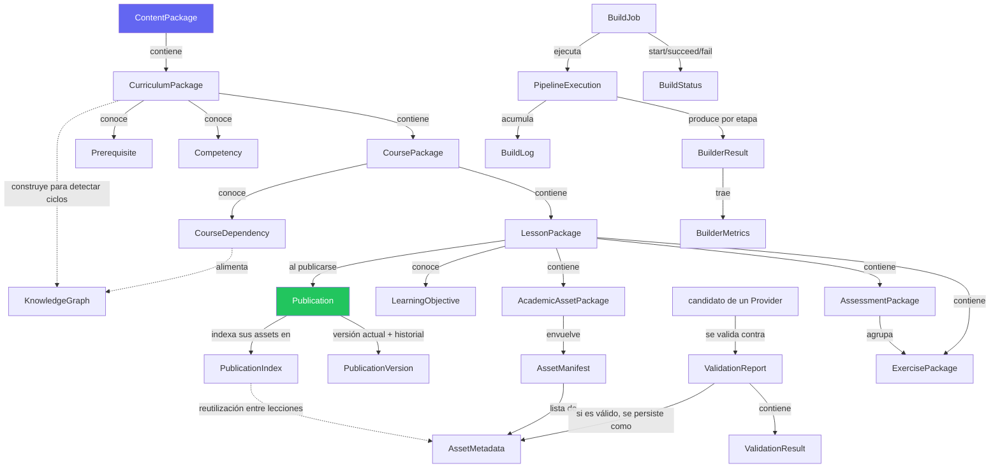
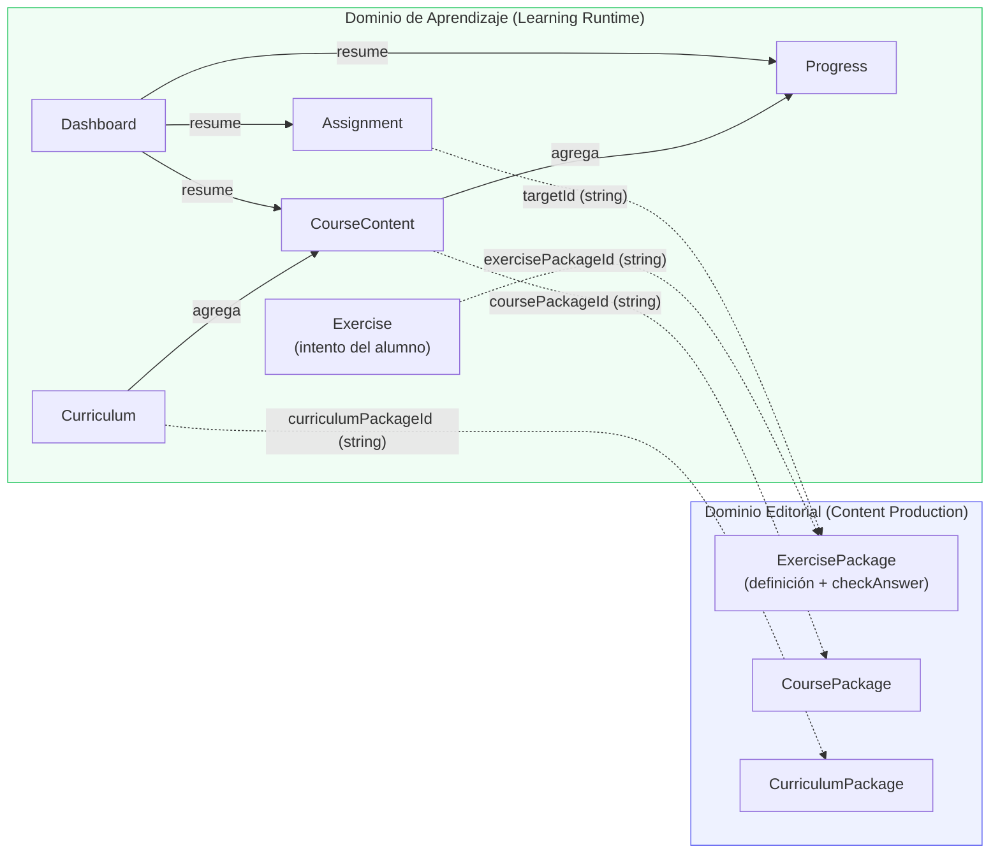

# Auditoría del Modelo de Dominio

**Fecha:** 2026-08-05
**Alcance:** revisión completa del dominio del proyecto — separación de Dominio Editorial (Content Production) y Dominio de Aprendizaje (Learning Runtime), reemplazo de estructuras ad-hoc por modelos tipados y validados.

> **Nota de alcance previa:** este repositorio (`Language.AI`) es Node.js/Express + React, sin Python. No existía `models.py` ni los modelos runtime mencionados en la solicitud original (`Exercise`, `Curriculum`, `CourseContent`, `Assignment`, `Dashboard`, `Progress`) — se confirmó con el usuario antes de empezar que debían **construirse desde cero** en JavaScript, junto con el dominio editorial completo. El "problema actual" descrito (dominio modelando solo el runtime) se interpretó como: falta *todo* el dominio editorial, y el runtime tampoco existía aún como modelos propios.

---

## 1. Resumen ejecutivo

Se creó un dominio completo en `server/src/domain/`, separado en dos paquetes que nunca se importan entre sí:

```
server/src/domain/
  shared/DomainEntity.js      <- base común: valida con Zod al construir, cada modelo es una clase real
  editorial/                  <- Dominio Editorial (Content Production) — 29 modelos
  runtime/                    <- Dominio de Aprendizaje (Learning Runtime) — 6 modelos
```

El código existente del Academic Asset Builder (`server/src/asset-builder/`) se refactorizó para consumir estos modelos en vez de objetos planos, sin cambiar ningún contrato externo (rutas HTTP, formato de los `.json` persistidos, salida del CLI).

**Verificado, no solo declarado:** cada afirmación de este informe (validación real, comportamiento real, separación real, compatibilidad real) se probó ejecutando código — ver sección 8.

---

## 2. Modelos nuevos

### 2.1 Dominio Editorial (`domain/editorial/`) — 29 modelos

Todos extienden `DomainEntity`: se validan con Zod al construirse (tipos, restricciones, valores por defecto) y cada uno tiene comportamiento propio, no son contenedores.

| Modelo | Archivo | Comportamiento real (no anémico) |
|---|---|---|
| `BuildStatus` | `enums.js` | Máquina de estados (`pending→running→succeeded/failed/cancelled`); `canTransitionTo`/`transitionTo` rechazan transiciones ilegales |
| `PublicationStatus` | `enums.js` | Igual que arriba para `draft→published→deprecated→retracted` |
| `Concept` | `valueObjects/Concept.js` | `matchesKeyword()` |
| `LearningObjective` | `valueObjects/LearningObjective.js` | Taxonomía de Bloom real; `isHigherOrder()`, `cognitiveRank()` |
| `Prerequisite` | `valueObjects/Prerequisite.js` | `isSatisfiedBy(proficiencyMap)` |
| `CourseDependency` | `valueObjects/CourseDependency.js` | `blocksAccess()` (hard vs soft) |
| `ValidationResult` | `valueObjects/ValidationResult.js` | `isBlocking()` (error no pasado = bloqueante) |
| `ValidationReport` | `valueObjects/ValidationReport.js` | `isValid()`, `blockingFailures()`, `warnings()` |
| `BuildLog` | `valueObjects/BuildLog.js` | `isError()` |
| `BuilderMetrics` | `valueObjects/BuilderMetrics.js` | `totalAssets()`, `reuseRatio()` |
| `AssetMetadata` | `valueObjects/AssetMetadata.js` | Envuelve el `assetMetadataSchema` ya existente (cero duplicación); `isOpenlyLicensed()`, `matchesLicenseAllowlist()` |
| `KnowledgeNode` | `valueObjects/KnowledgeNode.js` | `isRelatedTo()` |
| `Competency` | `knowledge/Competency.js` | `isSatisfiedByObjectives(objectives)` |
| `KnowledgeGraph` | `knowledge/KnowledgeGraph.js` | `hasCycle()`, `topologicalOrder()` (Kahn), `getPrerequisitesFor()` |
| `BuilderResult` | `pipeline/BuilderResult.js` | `hasErrors()`, agrega logs |
| `PipelineExecution` | `pipeline/PipelineExecution.js` | `durationMs()`, `failedStages()`, `succeeded()` |
| `PublicationVersion` | `publication/PublicationVersion.js` | Conoce versión/fecha/estado/**compatibilidad**; `isCompatibleWith()`, `publish()`, `deprecate()`, `retract()` |
| `BuildJob` | `publication/BuildJob.js` | `start()/succeed()/fail()/cancel()` vía `BuildStatus`; `durationMs()` |
| `PublicationManifest` | `publication/PublicationManifest.js` | `totalAssets()`, `getManifestForLesson()` |
| `PublicationIndex` | `publication/PublicationIndex.js` | `findReusable()`, `hasChecksum()`, `upsertLessonEntries()` — la lógica de reutilización, antes suelta en `libraryIndex.js` |
| `CacheManifest` | `publication/CacheManifest.js` | Deduplicación por lote (reemplaza un `Set()` ad-hoc) |
| `Publication` | `publication/Publication.js` | `publish()`, `rollbackTo()`, `isCompatibleWith()`, `isLive()` |
| `AssetManifest` | `packages/AssetManifest.js` | `assetCountByType()`, `averageQuality()` |
| `ExercisePackage` | `packages/ExercisePackage.js` | `checkAnswer(response)` — grading real, no solo datos |
| `AssessmentPackage` | `packages/AssessmentPackage.js` | Conoce **rúbricas, criterios, evaluación**; `evaluate(responses)` calcula puntaje real |
| `AcademicAssetPackage` | `packages/AcademicAssetPackage.js` | `isComplete()`, `hasRequiredGaps()` — puente al pipeline de assets ya existente |
| `LessonPackage` | `packages/LessonPackage.js` | Extiende `lessonContentSchema` existente; `isReadyForPublication()`, `objectiveCoverageByBloomLevel()`, `toLessonContent()` (adaptador) |
| `CoursePackage` | `packages/CoursePackage.js` | `hardDependencies()`, `isReadyForPublication()` |
| `CurriculumPackage` | `packages/CurriculumPackage.js` | Conoce **competencias, prerequisitos, cobertura**; `coverage()`, `hasCyclicCourseDependencies()`, `coursePublicationOrder()` |
| `ContentPackage` | `packages/ContentPackage.js` | `totalCourses()`, `totalLessons()`, `isReadyForPublication()` |

### 2.2 Dominio de Aprendizaje (`domain/runtime/`) — 6 modelos

Construidos desde cero (no existían). Referencian el dominio editorial **solo por id** (`exercisePackageId`, `coursePackageId`, `curriculumPackageId`, `targetId`) — nunca importan una clase editorial.

| Modelo | Comportamiento real |
|---|---|
| `Progress` | `recordCompletion()`, `masteryLevel()` (categórico), `isComplete()` |
| `Exercise` | El **intento** de un alumno (no la definición — esa es `ExercisePackage`); `submit()`, `recordGrade()`, `canRetry()` |
| `Assignment` | `isOverdue()` calculado (no un campo que alguien olvida actualizar), `submit()`, `grade()` |
| `CourseContent` | `completionPercentage()`, `nextIncompleteLessonId()` |
| `Curriculum` | `overallProgress()` (promedio sobre sus `CourseContent`) |
| `Dashboard` | Agregado de vista: `summary()`, `upcomingAssignments()`, `overdueAssignments()`, `atRiskCourses()` |

---

## 3. Modelos eliminados

**Ninguno.** No existían modelos previos que reemplazar por completo (no había `models.py` ni equivalente). Lo que existía eran estructuras ad-hoc (objetos planos, esquemas Zod sueltos) — esas se **envolvieron o refactorizaron**, no se eliminó funcionalidad. Ver sección 5.

---

## 4. Modelos refactorizados (código existente actualizado)

| Archivo | Qué cambió |
|---|---|
| `asset-builder/validation/AssetValidator.js` | Cada check ahora produce un `ValidationResult` tipado; se agregan a un `ValidationReport` en vez de un array de strings `reasons` |
| `asset-builder/providers/ResourcePriorityChain.js` | Usa `report.isValid()`/`blockingFailures()` en vez de `.passed`/`.reasons`; deduplicación por lote con `CacheManifest` en vez de un `Set()` desnudo |
| `asset-builder/persistence/AssetLibrary.js` | Construye `AssetMetadata`/`AssetManifest` en vez de `assetMetadataSchema.parse()` + objetos planos |
| `asset-builder/persistence/libraryIndex.js` | Ahora es una capa de persistencia delgada sobre `PublicationIndex` (dominio) — la lógica de scoring/relevancia se movió al modelo; se corrigió un bug latente (`e.title` siempre `undefined`, nunca existió ese campo) |
| `asset-builder/maintenance/assetMaintenance.js` | Usa `isDuplicateChecksumExcluding` del dominio en vez de filtrar un array manualmente |
| `asset-builder/pipeline/buildLessonAssets.js` | Agrega un `BuilderResult` (con `BuilderMetrics`, `BuildLog[]`) al resultado — de forma aditiva, sin quitar campos existentes |
| `scripts/build-lesson.js` | Imprime una línea adicional con el resumen del `BuilderResult` |

---

## 5. Estructuras ad-hoc reemplazadas

| Antes | Después |
|---|---|
| `AssetValidator` devolvía `{ passed, reasons: string[], scores, dimensions, checksum }` | `{ report: ValidationReport, scores, dimensions, checksum }` — `report.results` son `ValidationResult[]` tipados |
| `academy/_index.json` cargado como array plano + funciones sueltas (`queryIndex`, `isDuplicateChecksum`) reimplementando scoring inline | `PublicationIndex` (dominio) con `findReusable()`/`hasChecksum()`/`upsertLessonEntries()` — `libraryIndex.js` solo hace I/O |
| `metadata.json` construido como `{lessonId, courseId, ..., assets: [...]}` a mano | `new AssetManifest({...})`, serializado vía `toJSON()` |
| Cada asset persistido vía `assetMetadataSchema.parse({...})` (objeto validado pero anémico) | `new AssetMetadata({...})` — mismo schema (reutilizado, no duplicado) + comportamiento (`isOpenlyLicensed()`, etc.) |
| `new Set()` para deduplicar candidatos dentro de un mismo lote de construcción | `CacheManifest` |
| Resultado de `buildLessonAssets()`: objeto plano `{lessonId, version, published, ...}` sin resumen tipado del resultado | Se agregó `builderResult: BuilderResult` (con `BuilderMetrics`/`BuildLog[]`) — aditivo |

### Fuera de alcance (decisión documentada, no descuido)

- **`AssetAnalyzer`'s resultado de análisis** (`mainTopic`, `keywords`, `excerpts`, `formulas`, ...) se dejó como objeto plano. No es una entidad persistida ni está en la lista de modelos solicitada — es un resultado de cómputo transitorio consumido inmediatamente por el Planner. Documentado aquí para que la decisión sea explícita, no un olvido.
- **`AssetPlanItem`** (`asset-builder/schemas.js`) ya estaba validado con Zod (`assetPlanItemSchema`) y tampoco está en la lista solicitada — se dejó como está (ya cumple "cada modelo debe validar automáticamente").

---

## 6. Contratos mejorados / compatibilidad

- **`AssetMetadata.schema === assetMetadataSchema`** (el mismo objeto Zod, reutilizado literalmente, no reescrito) — cero riesgo de que las dos definiciones diverjan.
- **`LessonPackage.schema = lessonContentSchema.extend({...})`** — el contrato que ya consume el pipeline de assets (`buildLessonAssets`) no cambió; `LessonPackage.toLessonContent()` es el adaptador explícito de vuelta a ese contrato.
- **Cero cambios en las rutas HTTP** (`/api/academy/*`, `/api/voice/*`, `/api/ai/*`, `/api/consent`, `/api/feedback`): las respuestas JSON son idénticas en forma (verificado, sección 8).
- **Cero cambios en el formato de archivos persistidos** (`metadata.json`, `current.json`, `_index.json`, `content.json`): mismas claves, mismos tipos (verificado, sección 8) — porque `toJSON()` de cada modelo devuelve exactamente los mismos campos que antes se escribían a mano.
- **Bug real corregido en el camino:** `libraryIndex.js` intentaba usar `e.title` para scoring de relevancia, pero `AssetMetadata` nunca tuvo ese campo — era ruido inofensivo (tokenizaba la palabra `"undefined"`), corregido al formalizar la lógica en `PublicationIndex.findReusable()`.

---

## 7. Relaciones entre entidades

**Jerarquía editorial (contención):**
`ContentPackage` → `CurriculumPackage[]` → `CoursePackage[]` → `LessonPackage[]` → `ExercisePackage[]` / `AssessmentPackage[]` / `AcademicAssetPackage`.

`CurriculumPackage` conoce además `Competency[]` y `Prerequisite[]`; `CoursePackage` conoce `CourseDependency[]`; `LessonPackage` conoce `LearningObjective[]`. `CurriculumPackage.buildCourseDependencyGraph()` construye un `KnowledgeGraph` real a partir de las dependencias entre cursos para detectar ciclos — no es una relación decorativa, la usa `hasCyclicCourseDependencies()`/`coursePublicationOrder()`.

**Publicación:** `Publication` (uno por curso/currículo/lección publicable) tiene un `currentVersion: PublicationVersion` y un historial. `AcademicAssetPackage` envuelve un `AssetManifest` (lista de `AssetMetadata`). `PublicationIndex` es el índice *transversal* — no pertenece a una lección, agrega `AssetMetadata` de toda la biblioteca para reutilización entre lecciones.

**Pipeline:** `BuildJob` (una solicitud de build) → `PipelineExecution` (una ejecución, con `BuildLog[]` y `BuilderResult[]` por etapa) → cada `BuilderResult` trae `BuilderMetrics` y puede acumular `ValidationReport`s (uno por candidato evaluado, cada uno con `ValidationResult[]`).

**Frontera Editorial ↔ Runtime (la relación más importante):** el runtime **nunca** importa una clase editorial. Cada modelo runtime guarda el id del paquete editorial que referencia (`exercisePackageId`, `coursePackageId`, `curriculumPackageId`, `targetId`) como `string`. La capa de aplicación (fuera del dominio) es la única que conoce ambos lados y traduce entre ellos — por ejemplo, llama `exercisePackage.checkAnswer(response)` (editorial) y luego `runtimeExercise.recordGrade(resultado)` (runtime).

### 7.1 Diagrama — jerarquía editorial y pipeline



### 7.2 Diagrama — frontera Dominio Editorial / Dominio de Aprendizaje

Lo que este diagrama muestra es la ausencia de una flecha: **no hay ninguna línea sólida cruzando la frontera** — solo referencias por id (línea punteada, sentido único: runtime → editorial). Verificado con `grep` (sección 8): cero imports en cualquier dirección entre `domain/runtime/` y `domain/editorial/`.



---

## 8. Verificación realizada

Todo lo anterior se ejecutó, no solo se escribió:

1. **Validación real:** 5 casos de construcción con datos inválidos (`bloomLevel` inventado, `type` de ejercicio inválido, `versionNumber` negativo, elemento no-instancia en un array tipado, `passingScore` fuera de rango) — los 5 fueron rechazados con `ZodError`.
2. **Comportamiento real, no anémico:** `ExercisePackage.checkAnswer()`, `AssessmentPackage.evaluate()`, `LessonPackage.toLessonContent()`/`objectiveCoverageByBloomLevel()`, `CurriculumPackage.coverage()`/`hasCyclicCourseDependencies()`, `Publication.publish()`, `KnowledgeGraph.hasCycle()`/`topologicalOrder()` — todos ejecutados con datos reales y resultado verificado.
3. **Separación editorial/runtime:** `grep -rn "from '.*editorial" domain/runtime/` y `grep -rln "from '.*runtime" domain/editorial/` — ambos sin resultados.
4. **Regresión del pipeline existente:** las 3 lecciones de ejemplo (álgebra/biología/historia) se reconstruyeron con el código refactorizado — mismo comportamiento del Planner por disciplina, misma reutilización vía `local-library` al reconstruir, mismo `BuilderResult.success` reflejando correctamente huecos "required" vs "recommended"/"optional".
5. **Formato de archivos sin cambios:** se inspeccionaron `metadata.json` y `_index.json` reconstruidos — mismas claves exactas que antes del refactor.
6. **Rutas HTTP sin cambios:** `/api/academy/:discipline/:course/:lesson`, `/api/academy/file/*` (200 con bytes reales, 404 en lección inexistente, 404 en versión no publicada, 400 en path traversal), `/api/ai/chat` — probadas en vivo contra el servidor.
7. **Ciclo completo de mantenimiento:** se borró un asset publicado y se corrió `assets:maintain` — detectado, reparado con contenido real de la lección, índice actualizado — mismo comportamiento que antes del refactor (incluyendo los dos casos límite ya corregidos en el turno anterior: candidato de reutilización apuntando a su propio archivo borrado, y auto-rechazo por "duplicado").
